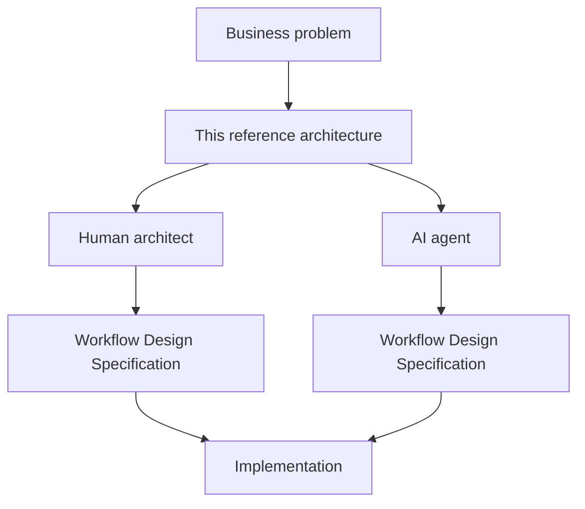

# Workflow Execution Reference Architecture (WERA)

Workflows & Process Integration WG · Agentic AI Foundation

Status: Proposal snapshot (`v2-descriptor-driven`)

## What this is

A vendor-neutral reference architecture for **workflow execution**, organised around one central unit — the **workflow run** — spanning the full spectrum from fully deterministic automation, through model-assisted and hybrid workflows, to bounded-agentic and multi-agent execution.

It is **not** organised around "single-agent vs multi-agent." Agent count is one classification axis, not the organising principle.

## The one idea that makes this different

The whole repository is designed to have **two outputs that converge on the same result**:



A **Workflow Design Specification (WDS)** is the artifact both a human and an AI agent produce by following the same method. In this repository the WDS is a machine-readable **workflow descriptor** (`*.wera.yaml`) plus its human-readable rendering.

### The acceptance test

The primary success criterion for this repository is **not** "is the document nice." It is:

> Can someone — human or AI — take a **new** use case and, using **only this repository**, produce a quality Workflow Design Specification?

If yes, the reference architecture works. If no, the problem is not "20 more pages of prose"; it is that the repository did not guide the user through the process. See [docs/acceptance-test.md](docs/acceptance-test.md).

## Two ways to use this repository

**Human mode** — read in this order:
[START-HERE](START-HERE.md) → [architecture principles](docs/architecture-principles.md) → [workflow design method](playbook/workflow-design-method.md) → [patterns](patterns/README.md) → [examples](examples/README.md) → design your workflow.

**AI mode** — point an agent at the repository with a short instruction:

```
You are a workflow architect.
Read this repository. Follow the Workflow Design Method.
Produce a Workflow Design Specification for the use case below.
Do not invent architectural concepts outside the repository.
Reuse existing patterns whenever possible.
If you introduce a new concept, explain why existing concepts were insufficient.

Design workflow for: <use case + requirements>
```

The full instruction lives in [playbook/ai-agent-instructions.md](playbook/ai-agent-instructions.md). Everything else the agent needs is in the repository.

## Repository map

| Area | Question it answers |
|---|---|
| [`docs/`](docs/) | How do I read and review this repository? |
| [`foundations/`](foundations/) | What are the scope, concepts, principles, and non-negotiable rules? |
| [`model/`](model/README.md) | What are the building blocks and how are they classified and combined? |
| [`patterns/`](patterns/README.md) | What recurring problems have reusable solutions? |
| [`profiles/`](profiles/README.md) | What coherent whole-run execution styles exist? |
| [`selection/`](selection/README.md) | How do I choose the right patterns and profile? |
| [`overlays/`](overlays/README.md) | What cross-cutting controls apply, and what belongs to other WGs? |
| [`readiness/`](readiness/) | When is a workflow production-ready and conformant? |
| [`descriptor/`](descriptor/README.md) | How is a workflow captured as a machine-readable WDS? |
| [`playbook/`](playbook/workflow-design-method.md) | How does a human or AI actually design a workflow? |
| [`examples/`](examples/README.md) | Worked examples that double as few-shot exemplars. |
| [`decisions/`](decisions/README.md) | Why were the important choices made? |

## Coded vocabulary

Every concept carries a stable code (design principles `DP-##`, invariants `INV-###`, primitives 3-letter mnemonics, patterns `WP##`, profiles `EP#`, overlays `OV-##` / external boundaries `XB-##`, readiness `RT#`, conformance `CL#`, and eight classification axes). The complete vocabulary is also published as machine-readable data in [`descriptor/registry.yaml`](descriptor/registry.yaml), so an AI agent can load the reference architecture as data rather than prose.

## Status & maturity

This is a proposal snapshot that uses **example-driven maturation**: the full structure exists, but only the concepts and patterns required by the current worked example ([invoice processing](examples/invoice-processing/README.md)) are marked **Mature**. Everything else is an explicit **Proposal** with open questions. See [ROADMAP.md](ROADMAP.md).

## Working style

- Async first: use PR comments to discuss and converge.
- Fork-first: contributors work in a fork or branch and open PRs to the workstream branch.
- Keep drafts concise; use decision notes ([decisions/](decisions/README.md)) when a choice needs recording.
- Use explicit "open questions" instead of blank sections.

## Links

- Charter (source of truth): [charter.md](../../charter/charter.md)
- WG repo: https://github.com/aaif/wg-workflows-and-process-integration
