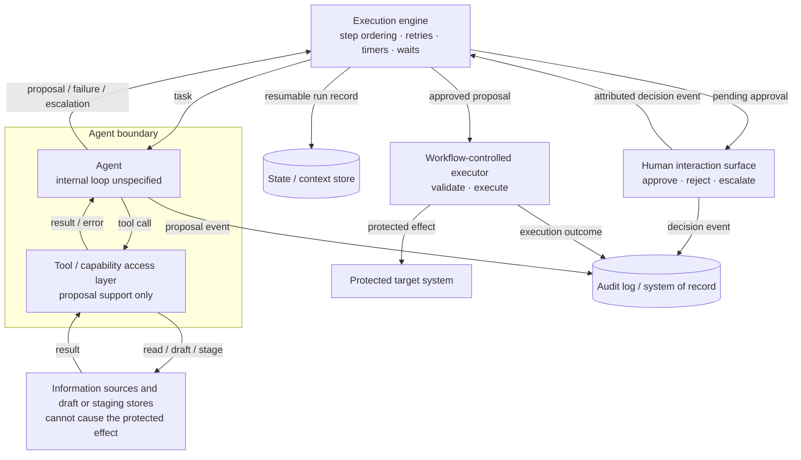

# Single-Agent Process with Human Approval

**The job it serves:** Human-approved operation: an agent prepares an action, a named person approves or rejects it, and only then may the protected effect occur \
**Built from patterns:** [Proposal/execution split](../patterns/proposal-execution-split.md) · [Human approval gate](../patterns/human-approval-gate.md) · [Durable wait](../patterns/durable-wait.md) \
**Requires capabilities:** Execution engine · agent · tool access layer · state/context store · human interaction surface · workflow-controlled executor · audit log \
**Audience:** Engineers building agentic workflows · architects reviewing designs · the approvers and risk owners related to the gate this architecture implements

## Status

Draft for working group review. Nothing here is locked.

## Purpose

The reference architecture for a common enterprise job: **an agent prepares
an action, a human approves it, the system executes it.**

Use when an agent's output can change real systems — a refund, a
configuration change, an outbound message — and the enterprise needs
enforceable behavior at the point of effect: because the effect is costly or
hard to reverse, because audit obligations require proving exactly what a
person authorized, or because a named person must own the decision.

This architecture puts a human-mediated structural break between the agent's
proposal and the protected effect. The agent may investigate, calculate, and
construct a proposal, but it cannot invoke the capability that causes that
effect. A human reviews the exact proposal, and a separate,
workflow-controlled executor acts only after recording explicit approval.

Built to the invariants in its composed patterns, this architecture guarantees:

- **No protected effect occurs without human approval** — and what executes
  is exactly what was approved, not a revision of it.
- **The run survives the wait.** Approvals take hours or days; no restart,
  deploy, or crash loses a pending request or repeats a completed action.
- **Every run ends in a known state**, with the full intent → decision →
  effect chain — proposer, approver, executor — in the system of record.

**Reading paths:** For the *what* and the *why*, read this section and the
illustrative refund walkthrough — together they carry the architecture in
practice. Every other section is implementation guidance for readers building
or reviewing this architecture for themselves.

## Is this your architecture? (checklist)

Bring a use case, walk the questions:

1. **Does the reasoning work require more than one independent agent?** Agent
   count is a design outcome, not a use-case property —
   default to one agent and let the workflow provide the structure. Route
   to a future job-oriented multi-agent architecture only on concrete signals:
   independent subtasks that must run in parallel, duties that policy requires
   be split across separate identities, or coordination across workflows owned
   by different teams. No multi-agent architecture is currently defined.
   "The task is big" is not a signal — capacity is an implementation concern,
   and it shifts with every model generation.
2. **Can any step cause a protected effect that needs human sign-off?** If yes,
   and approve/reject (with optional feedback) is the interaction you need —
   this is your architecture; keep going. If the human's role is richer than
   a gate (co-editing the draft, steering the agent mid-task, supervising as
   it acts), that is a different human-in-the-loop flow this architecture
   does not cover — don't force it into a gate. If authorization comes from an
   automated policy rather than a person, that is a separate architecture with
   a different attribution and failure topology. If no approval is required,
   this is not your architecture.
3. **Will the approval take longer than a process lives?** Almost always yes
   (humans answer in hours, not milliseconds) — which is why the
   [durable wait](../patterns/durable-wait.md) is a required pattern here,
   not an option.
4. **Can you separate the steps that must carry guarantees or attribution
   from the steps that are open-ended?** Steps with guarantee requirements —
   validated inputs, the attributed decision, the idempotent execution of
   the approved action — belong outside the agent boundary as
   workflow-controlled steps, where guarantees can actually be enforced. The
   open-ended
   steps (interpreting the request, drafting the proposal) are what the
   agent is for. If you can't yet draw that line, draw it before choosing
   any architecture — the agent and protected-effect boundary in *Structure*
   is that line, drawn for this job.

The same checklist works in reverse to assess an existing workflow: check it
against each invariant, exit state, and boundary below — the gaps are your
findings.

## Variants

No variants are currently defined. Two nearby flows are deliberately not
variants of this architecture:

- **Policy-authorized operation** replaces a named human decision with a
  versioned policy evaluation. Its attribution evidence, failure states, and
  timing differ, so it requires a separate architecture.
- **Straight-through automation** removes the defining human-approval
  guarantee. It serves a different job and requires its own risk boundary.

A durable wait on a timer or external callback is the
[durable wait](../patterns/durable-wait.md) pattern used in another
composition, not a variant of this architecture.

## Structure

Component-and-relationship level only. The agent's internal reasoning loop is
deliberately unspecified — deterministic and ReAct-style internals are equal
implementation choices inside the boundary.



### What crosses each arrow

Names, not formats: these say what crosses each boundary and the rule that
governs it there. Field-level definitions (formats, event shapes, binding
semantics) are deliberately left out — that is future interoperability work
(charter 3E), best done after the pattern entries accumulate more examples
of how real runtimes handle these boundaries.

| Arrow | What crosses | Invariant at this boundary |
|---|---|---|
| Engine ⇄ agent | Task in; exactly one of proposal / failure / escalate out | The agent cannot cause the protected effect |
| Engine ⇄ human surface | Pending approval (proposal reference + deadline) in; decision event (approve/reject, who, when) out | The decision binds to an immutable proposal version; no default-approve |
| Agent ⇄ tool / capability access layer | Tool call; result or error | Tools may support investigation and proposal construction but cannot expose the capability or credentials that cause the protected effect |
| Engine ⇄ workflow-controlled executor | Approved proposal in; execution outcome out | Only the exact approved proposal may reach the protected target; retries are idempotent |
| Engine → state store | Run record (state + position, fully resumable) | While parked, the record *is* the run |
| All → audit log | Event record (run id, step, outcome) | One run identity joins intent, decision, and effect |

The required capabilities and their responsibilities:

| Capability | Responsibility in this architecture | Charter basis |
|---|---|---|
| Execution engine / orchestrator | Owns step ordering, retries, timers, and waits; invokes the agent as one step among others | 3A |
| Agent | Performs the reasoning-heavy step(s); internals unspecified | 3A |
| Tool / capability access layer | Supports investigation and proposal construction without exposing the protected-effect capability | 3C |
| State / context store | Persists workflow state so runs can pause and resume | 3B |
| Audit log / system of record | Records execution history, step outcomes, decision points — distinct from Observability WG's traces/metrics | 3B |
| Human interaction surface | Presents pending approvals; captures approve/reject/escalate | 3D |
| Workflow-controlled executor | Validates and executes the exact approved proposal using capabilities unavailable to the agent | 3A, 3F |

These are capability roles, not a prescribed deployment topology. An
implementation may realize each as a separate technical component or combine
several in one platform. The workflow-level building blocks a definition is
written in (task, branch, retry, human gate) are a separate list, deferred to
the taxonomy work.

## Pattern composition

Per-pattern invariants, failure modes, and runtime examples live in the
pattern entries — this table records where each pattern sits in *this*
composition and why it is required:

| Pattern | Where it sits | Why it is required here |
|---|---|---|
| [Proposal/execution split](../patterns/proposal-execution-split.md) | Between the agent's proposal and the protected effect | Probabilistic intent must not directly cause the governed effect; authorization must bind to exactly what executes |
| [Human approval gate](../patterns/human-approval-gate.md) | At the authorization decision | The decision must be made by an identified, authorized person and recorded with the proposal they reviewed |
| [Durable wait](../patterns/durable-wait.md) | At the approval gate | Approvals take hours or days; the run must outlive every process that hosts it |
| Idempotent executor *(candidate — entry not yet written)* | The execution step | Retries after approval must not repeat the effect |

**Invalid composition — the one shortcut that breaks everything:** the agent
can invoke the protected-effect capability directly or obtain the executor's
credentials. That is not a leaner variant of this architecture; it removes
the gate's entire value, because approval can be bypassed and review happens
after the risk instead of before it.

## The agent and protected-effect boundary

What the agent is allowed to do:

- Interpret the goal and produce a plan, draft, or proposed action
- Call tools for investigation, calculation, and proposal construction,
  including writes to draft or staging stores that cannot cause the protected
  effect
- Signal completion, failure, or "cannot proceed — escalate"

What must be handled outside the agent:

- Triggering and input validation
- Possession and invocation of the protected-effect capability
- Retries and idempotency of protected-effect calls
- Recording run state and resuming from it
- The human gate and escalation path
- Validation and final execution of approved actions
- Audit logging

## Choosing deterministic and model-driven steps

- Side-effecting execution is a rule-based, workflow-controlled step *after*
  the gate, not an agent action. The agent's role ends at the proposal;
  execution belongs to the workflow.
- Retries around the agent step need idempotency at the workflow level — an
  agent step re-run is not guaranteed to produce the same output.
- Use conventional workflow logic for lookups, transforms, validation, and
  templates when their rules can be stated explicitly. Use model reasoning
  where the input is open-ended and interpretation or judgment is required.

## Exit states

Every way a run can end — each lands in the system of record. A run that can
end in a state not listed here is a bug in this architecture, not in the
implementation.

| Exit state | Reached when | Recorded as |
|---|---|---|
| Completed | Approved proposal executed successfully | Full intent → decision → effect chain |
| Rejected | Gate declines; feedback loop (if any) exhausted its iteration cap | Decision + rationale, per iteration |
| Expired | Approval timeout with no decision; escalation path also exhausted or declined | Timeout + escalation trail |
| Cancelled | An authorized requester or operator withdraws the run before the protected effect begins | Cancelling principal, reason, proposal version, and last run state |
| Escalated (handed off) | Run leaves this workflow for a human-owned process | Handoff target + state at handoff |
| Failed | Agent cannot produce a proposal, or execution fails past its retry budget | Failure class + last recorded state |

## Illustrative worked scenario: the refund

This walkthrough makes the architecture concrete but is not yet sourced
validation from the Use Cases workstream: *an agent drafts a customer refund,
finance approves it, and the ERP executes it.*

1. **Trigger** — a refund request arrives; a deterministic step validates it
   and the engine starts a run (audit: run started).
2. **Agent drafts** — the agent step reads the order history and policy
   through the tool access layer and produces a refund proposal — amount,
   justification, target account (audit: proposal + rationale).
3. **Durable wait** — the engine records the run's state and parks it at the
   gate. Finance answers in hours or days; the run survives restarts.
4. **Finance decides** — the interaction surface presents the proposal.
   Approve → continue; reject → terminate or loop back with feedback;
   timeout → escalate (audit: decision, who, when).
5. **ERP executes** — the workflow-controlled executor performs the approved
   refund with retries and idempotency keys. The agent is not involved.
6. **Close out** — outcome recorded; the system of record holds the full
   intent → approval → execution chain.

### The run over time — where durability lives

The component diagram can't show the property that makes this durable: the
run outlives any process that hosts it. Same scenario, lifecycle view:

```text
◄──────────── process lifetime 1 ────────────►    ◄──────── process lifetime 2 ────────►

trigger → validate → agent drafts → record run    approval event → reload run from
                                    → run PARKED  state store → record decision →
                                          ⏸       resume at gate → execute → close out
─────────────────────────────────────────────────────────────────────────────────────────
                                    └── hours or days pass; processes die and
                                        deploys happen — the run is not lost ──┘
```

### If the process dies mid-run

| If the process dies during… | What happens on restart | What makes it safe |
|---|---|---|
| 1. Trigger / validate | The trigger redelivers; validation re-runs | Validation is deterministic and side-effect-free |
| 2. Agent drafts | Engine re-runs the agent step from the last recorded state | Nothing has executed yet; a different draft is acceptable — the gate still stands between draft and effect |
| 3. Durable wait | Run reloads as parked, still waiting | The record *is* the run; no process memory is involved |
| 4. Human decides | Decision is recorded before resume; redelivery is deduplicated | Resume is idempotent — the same approval delivered twice executes once |
| 5. System executes | Execution step retries | Idempotency keys on the side-effecting call: retried, not repeated |
| 6. Close out | Audit write retries | Audit append is idempotent per run and step |

## Composition considerations

Concerns that only appear when the patterns combine — per-pattern invariants
live in the pattern entries:

- **Approval staleness.** The durable wait plus the proposal/execution
  split means the world can change between proposal and execution: a refund
  approved on Monday may exceed the customer's remaining balance by
  Thursday. Either the executor re-validates preconditions before acting, or
  approvals carry an expiry — one of the two, explicitly.
- **Bounded rejection loops.** Reject-with-feedback re-enters the agent
  step. Without an iteration cap and an exit to escalation, a strict
  reviewer plus a stubborn agent is an infinite loop with an LLM bill.
- **Proposal supersession.** A revised proposal is an in-run transition, not
  a terminal state. It invalidates any approval attached to the previous
  version and returns the run to pending approval. If the implementation
  instead starts a new run, the original run ends as cancelled with a link to
  its replacement.
- **One chain of custody.** Proposal, wait/resume, human decision, and effect
  records must share a run identity. Records that cannot be joined afterward
  fail the whole point of the gate.

## Out of scope (handled elsewhere)

- **Traces, metrics, and runtime telemetry** — Observability WG. This
  architecture's audit log is the system of record (execution history, step
  outcomes, decision points), which the charter explicitly distinguishes
  from observability signals.
- **Agent identity, delegation, and authorization** — Identity & Trust WG.
  This architecture requires the protected-effect capability and executor
  credentials to remain unavailable to the agent; how identities and grants
  enforce that separation is theirs.
- **Quality of the proposal** — Reliability & Accuracy WG. The gate ensures
  a human reviews the proposal; it does not make the proposal good. Prompt
  engineering and reasoning-quality evaluation are out of scope for this WG
  entirely.

## Validation record

Sourced scenarios from the Use Cases workstream provide validation. Every
scenario walked through this architecture gets a row, fit or no-fit;
illustrative examples are labeled separately until a source exists.

| Scenario | Source | Result | Notes |
|---|---|---|---|
| The refund (agent drafts, finance approves, ERP executes) | Working group discussion; pending a Use Cases workstream entry | Illustrative only — validation pending | Exercises all components and three composed patterns |

## Open questions

- Is *idempotent executor* its own pattern entry, or a clause of the
  proposal/execution split?
- Where exactly does the tool access layer end and the Identity & Trust
  WG's delegation concern begin?
- Does the audit log / system of record boundary with the Observability WG
  read the same to everyone? (Charter says yes; worth confirming once.)
