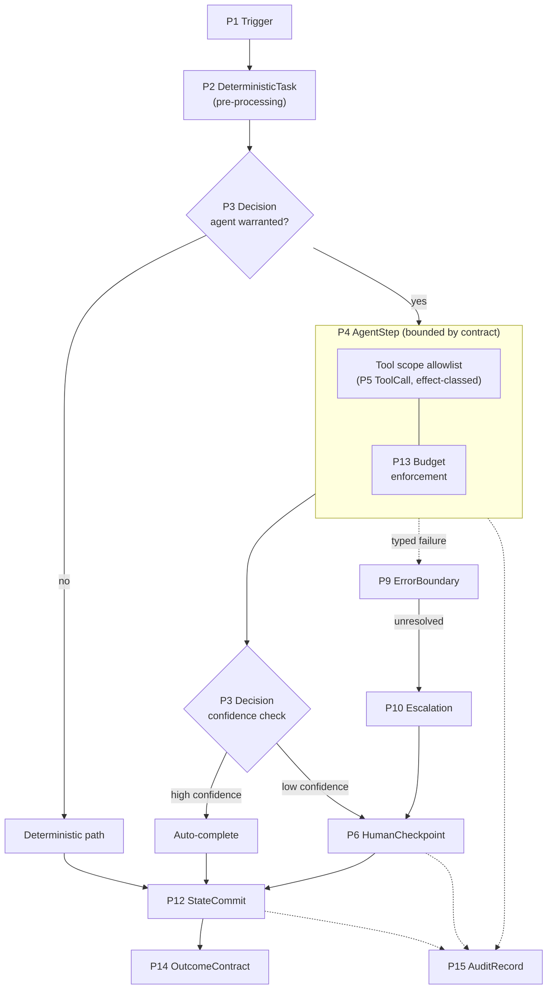
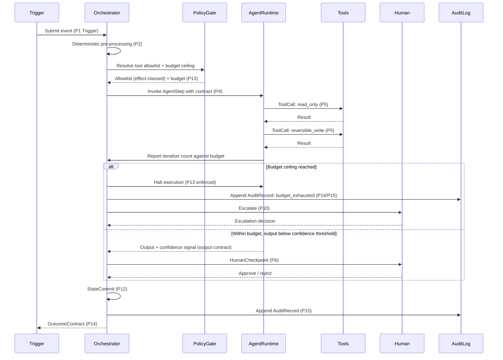

# AgentStep boundary contract

Applies to: [P4 AgentStep](../../taxonomy/primitives/p04-agent-step.md)

## Purpose

`P4 AgentStep` is the bounded, non-deterministic step inside an otherwise deterministic workflow: the workflow owns the process, and the agent is a bounded, contracted step inside it. This contract specifies that boundary: the interface between the deterministic workflow and the non-deterministic step, not the agent's own internal reasoning. Every `AgentStep` MUST declare the following eight elements before it is fit to run in production. Each is a required field on the contract, not an optional enhancement.

## Required elements

### 1. Goal specification

State what "done" looks like in the workflow's terms, not the model's. A goal expressed only as a natural-language prompt gives the orchestrator nothing to check against. The goal MUST be restated as a condition the workflow can evaluate independently of the model's own claim of completion: otherwise "success" is whatever the model asserts, which collapses `P14`'s termination classification back into an unverifiable self-report.

The goal specification MUST be a versioned, addressable artifact rather than an inline prompt string. It is revised across executions by the human steering loop described in [Loop tiers](../guidance/loop-tiers.md), and a goal that lives only inside a prompt cannot be diffed between runs. Without a diffable, addressable goal, there is no way to attribute a change in outcome to a change in the spec: the goal and the model's behaviour become inseparable, and the workflow loses the ability to reason about why one execution's result differs from the last.

### 2. Input contract

Input contract is a schema. Without one, the step is untestable and unversionable: there is no way to write a regression test against an input shape that can silently drift, and no way to version the step independently of the prompt that happens to consume it. The input contract is also what lets a `P2 DeterministicTask` feed an `AgentStep` without a human manually verifying the wiring on every change.

### 3. Output contract

Output contract is a schema, plus a machine-readable confidence or uncertainty signal, because downstream deterministic routing (`P3 Decision`) needs something to route on. Free-text output forces every consumer to either re-parse natural language or trust it uniformly. A typed output with a confidence field is what makes the confidence-based `Decision` in the reference structure below possible at all.

### 4. Tool scope

An allowlist, not a denylist, with each tool classified by effect: `read_only`, `reversible_write`, `irreversible`. An agent MUST NOT be granted an `irreversible` tool without either a `P6 HumanCheckpoint` or a deterministic policy gate in front of it. MCP defines optional tool annotations that this classification MAY bind to, but the [MCP specification](https://modelcontextprotocol.io/specification/2025-06-18) itself states that annotations from untrusted servers must not be relied upon. The workflow, not the tool, is therefore the authority on effect class; the classification MUST be asserted by the workflow's tool registry, not inferred at call time from server-supplied hints alone.

### 5. Budget

The `P13` ceilings: max iterations, max tool calls, max tokens/cost, wall-clock deadline. Unbounded agent loops are the characteristic failure mode of agentic workflows, and the only reliable control is external (enforced by the orchestrator), not requested in the system prompt. A budget stated in the prompt is a suggestion the model MAY ignore under its own reasoning; a budget enforced by the orchestrator is a hard stop the model cannot reason its way past.

### 6. Termination conditions

An explicit success predicate, failure predicate, and escalation predicate, each evaluated outside the model. "The model decides it's done" is not a termination condition. It is the model self-reporting against a goal it also authored, with no independent check. Termination conditions MUST be expressible as something the orchestrator, not the agent, evaluates.

Where the step iterates, its success predicate SHOULD read a [P19 EvaluationGate](../../taxonomy/primitives/p19-evaluation-gate.md) (a machine-checkable predicate the orchestrator can evaluate independently of the model). A termination condition with nothing to evaluate against degenerates into one of two things this contract already rejects: a fixed iteration count that bears no relationship to whether the work is actually done, or the model's own self-report of completion. An `EvaluationGate` gives the orchestrator a concrete, checkable answer to "has the success predicate been met" instead of a number chosen in advance or a claim taken on faith.

### 7. Identity and delegated authority

Whose authority the agent acts under, and the scope of that delegation. This is an interface to the Identity & Trust WG: this RA requires that every `AgentStep` declare an identity/delegation attribute, but the authentication mechanism, delegation protocol, and revocation model are that WG's domain, not specified here.

### 8. Observability contract

What the step MUST emit for the `P15 AuditRecord` to be reconstructable: step outcome, decision points crossed, tool invocations with their effect class, budget consumption against the ceiling, and any human intervention. This is workflow-level audit data, not a trace or a metric: see the Boundaries with other working groups section of [`single-agent.md`](../architectures/single-agent.md).

## Reference structure

The enforcement points are inside the `AgentStep` box, not around it: tool scope and budget are checked *before and during* execution, not audited after the fact. Everything downstream of `AgentStep` (the confidence-based `Decision`, `HumanCheckpoint`, `StateCommit`, `OutcomeContract`) is deterministic.

## Related

- [P4 AgentStep](../../taxonomy/primitives/p04-agent-step.md)
- [P19 EvaluationGate](../../taxonomy/primitives/p19-evaluation-gate.md)
- [Loop tiers](../guidance/loop-tiers.md)
- [Handoff contract](handoff.md)
- [`single-agent.md`](../architectures/single-agent.md)
