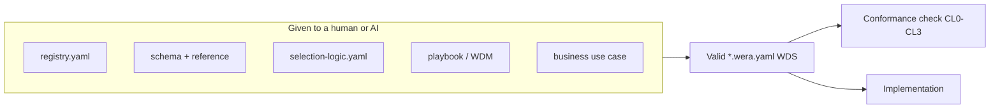

# The Workflow Descriptor

Status: Mature

## What this is

The **workflow descriptor** is the machine-readable form of a **Workflow Design Specification (WDS)** — the artifact both a human architect and an AI agent produce by applying WERA to a use case. It is the shared output that makes the [dual-mode acceptance test](../docs/acceptance-test.md) possible.

One descriptor is a single `*.wera.yaml` file with three blocks:

| Block | Contains | Populated from |
|---|---|---|
| `intake` | the business use case (outcome, inputs, nondeterminism justification, requested authority, assurance, side-effects, operations) | the [wizard questions](../selection/wizard-questions.md) |
| `design` | the resolved architecture (coordinates, five-authority allocation, primitive graph, effects, selected profile + patterns, overlays, boundaries, readiness, conformance target) | [selection logic](../selection/selection-logic.yaml) + review |
| `recommendation` | rationale, alternatives rejected, mandatory primitives, required views, exceptions | the designer's reasoning |

## Files here

- **[workflow-descriptor.schema.json](workflow-descriptor.schema.json)** — JSON Schema (draft 2020-12) that every descriptor validates against. All codes are constrained to the registry vocabulary.
- **[workflow-descriptor.reference.md](workflow-descriptor.reference.md)** — field-by-field human documentation.
- **[registry.yaml](registry.yaml)** — the entire coded vocabulary as data, so an agent can load WERA as data rather than prose.
- **[examples/invoice-processing.wera.yaml](examples/invoice-processing.wera.yaml)** — a complete, schema-valid WDS for the worked example (model-assisted, least-agentic end).
- **[examples/autonomous-maintenance-run.wera.yaml](examples/autonomous-maintenance-run.wera.yaml)** — a schema-valid WDS for an agent-directed convergence loop (`EP4`/`WP09`) — the autonomous end.
- **[examples/gated-delivery-pipeline.wera.yaml](examples/gated-delivery-pipeline.wera.yaml)** — a schema-valid WDS for a human-gated delivery pipeline (`EP1`/`WP07`) — the twin of the run above at the opposite HITL setting.

## Why it matters



Because the design is data, three things become mechanical: **authoring** (fill the schema), **checking** ([conformance](../readiness/conformance.md) `CL0`–`CL1` can be validated automatically), and **comparing** (two WDS artifacts for the same use case can be diffed — the heart of the acceptance test).

## Validating a descriptor

Any JSON-Schema validator works. For example, with a YAML-aware validator:

```bash
# using ajv-cli (npm) with a YAML loader, or convert YAML->JSON first
npx ajv-cli validate -s workflow-descriptor.schema.json -d examples/invoice-processing.wera.yaml
```

or in Python:

```python
import json, yaml, jsonschema
schema = json.load(open("workflow-descriptor.schema.json"))
doc = yaml.safe_load(open("examples/invoice-processing.wera.yaml"))
jsonschema.validate(doc, schema)
```
