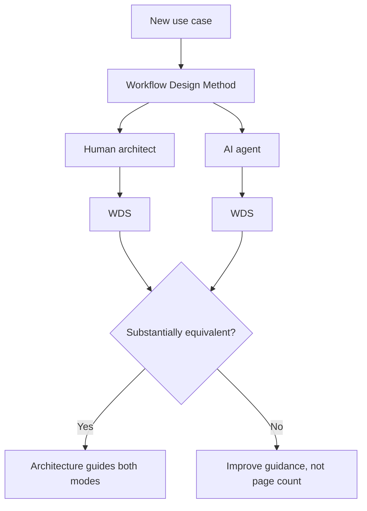

# Acceptance Test

Status: Mature

## The criterion

The primary success criterion for this repository is not whether the documents are polished. It is:

> **Can someone — a human architect or an AI agent — take a new use case and, using only this repository, produce a quality Workflow Design Specification (WDS)?**

If yes, the reference architecture is doing its job. If no, the corrective action is not "add more prose"; it is to improve how the repository **guides the user through the process**.

## Why this is the right test

A reference architecture that reads well but cannot be *applied* fails its users. Both consumers of this repository must succeed:

## What "quality WDS" means

A quality WDS:

- states the intended outcome and the workflow-run boundary;
- identifies the deterministic baseline before introducing nondeterminism;
- allocates the five authority types explicitly;
- places the workflow on the eight [classification](../model/classification.md) axes (its coordinates);
- selects a [profile](../profiles/README.md) and reuses [patterns](../patterns/README.md) rather than inventing structure;
- classifies and protects [effects](../model/classification.md);
- declares required [overlays](../overlays/README.md) and [external boundaries](../overlays/external-boundaries.md);
- names a [readiness tier](../readiness/readiness-tiers.md) and [conformance target](../readiness/conformance.md);
- validates against the [descriptor schema](../descriptor/workflow-descriptor.schema.json).

## How to run the test

1. Choose a use case not already covered by an example.
2. Independently produce a WDS in human mode and in AI mode (see [WDM](../playbook/workflow-design-method.md)).
3. Compare the two WDS artifacts. Differences in wording are fine; differences in profile, authority allocation, protected effects, or conformance target are signals.
4. Where they diverge or where either mode struggled, record the gap and improve the guidance (method, selection logic, or an exemplar) — not merely the reference prose.

## Relationship to conformance

The acceptance test measures whether the repository can *produce* a good design. [Conformance](../readiness/conformance.md) (`CL0`–`CL3`) measures whether a given workflow *follows* the architecture. They are complementary: a repository that passes the acceptance test makes conformant designs easy to produce.
