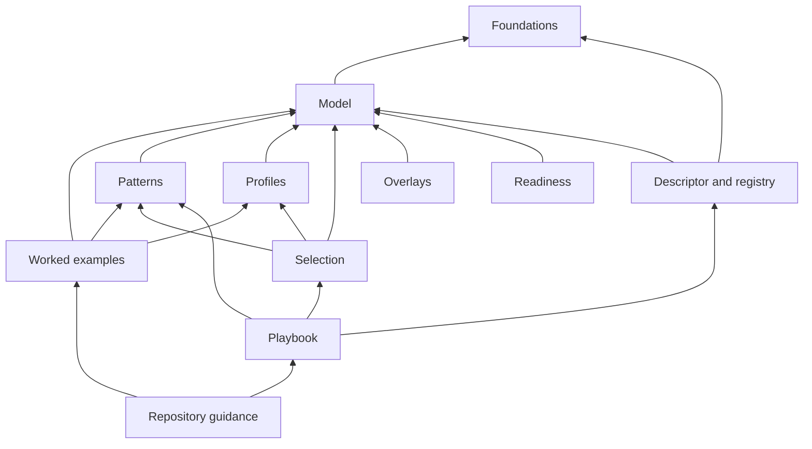
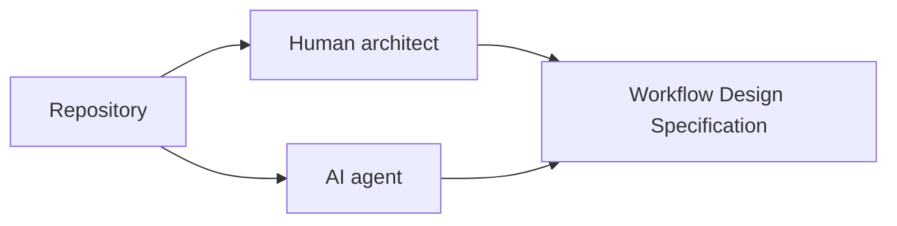

# Information Architecture

Status: Mature

## Purpose

Explain why the repository separates the **knowledgebase** (`ra/`), the **machine form** (`descriptor/`), and the **worked outputs** (`examples/`) — and how the nine numbered chapters inside `ra/` depend on each other.

## Top-level areas

The repository has three substantive areas plus entry and review material:

| Area | Question answered |
|---|---|
| `docs/` | How should readers understand, review, and navigate the repository? |
| [`ra/`](../ra/README.md) | **The knowledgebase** — the reference architecture itself, in nine numbered chapters (below). |
| `descriptor/` | How is a workflow captured as a machine-readable WDS, and where is the coded vocabulary as data? |
| `examples/` | How do the concepts work together in realistic cases (with their WDS outputs co-located), and how do they serve as few-shot exemplars? |

## The nine chapters inside `ra/`

| Chapter | Question answered |
|---|---|
| `01-foundations/` | What are the scope, shared concepts, design principles, and non-negotiable invariants? |
| `02-architecture-model/` | What are the reusable building blocks, how are they classified, and how may they be combined? |
| `03-patterns/` | What recurring architectural problems have reusable solutions (`WP##`)? |
| `04-profiles/` | What coherent whole-run execution styles combine the concepts (`EP#`)? |
| `05-selection/` | How does a designer choose patterns and a profile (wizard questions, coordinates)? |
| `06-overlays/` | What cross-cutting controls apply (`OV-##`), and what belongs to other WGs (`XB-##`)? |
| `07-readiness/` | When is a workflow production-ready (`RT#`) and conformant (`CL#`)? |
| `08-lifecycle/` | How does a human or AI actually design and review a workflow? |
| `09-evolution/` | What is unfinished (roadmap), and why were important choices made (decisions)? |

## Intended dependency direction

Examples depend on patterns, profiles, and core concepts. Patterns and profiles depend on the model and foundations. The foundations and model do not depend on any particular example, product, or runtime. The descriptor and registry encode the model; they do not extend it.

## The two outputs

The information architecture serves two consumers who must reach the same result.

The [Workflow Design Method](../ra/08-lifecycle/workflow-design-method.md) is the shared path; the [descriptor](../descriptor/README.md) is the shared artifact.

## Intentional incompleteness

Every document should be useful even when incomplete. Proposal-level documents contain purpose, scope, candidate structure, relationships, and open questions rather than empty headings or invented normative detail. Even proposal-level documents still carry their codes, so the [registry](../descriptor/registry.yaml) stays complete.
