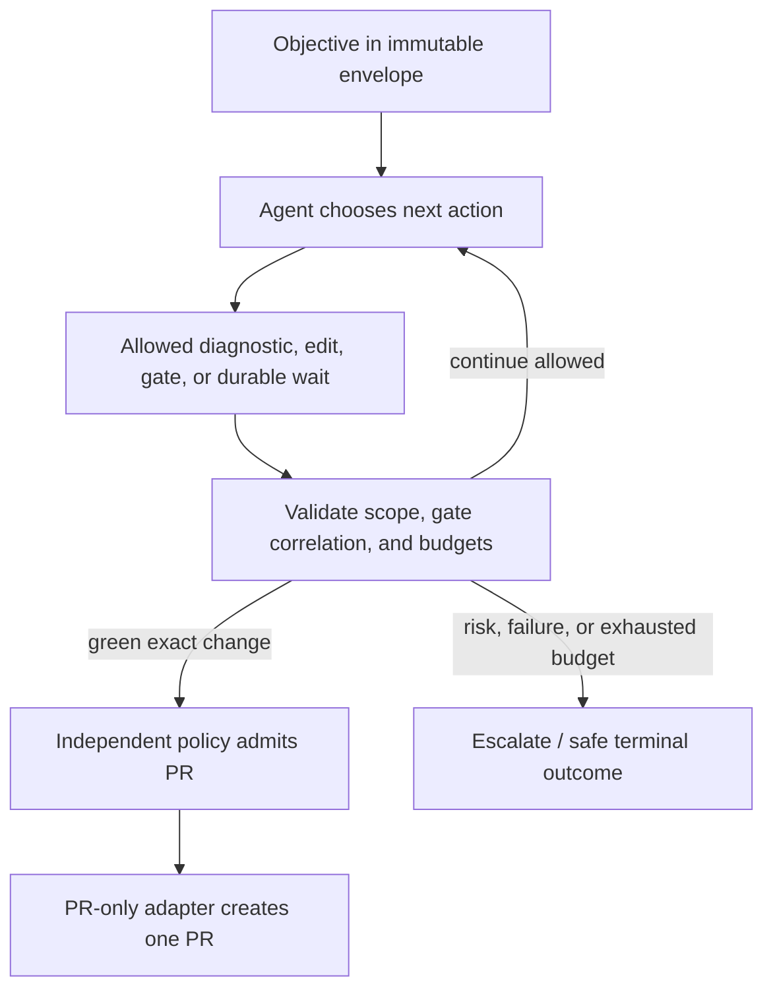

# Agent-Directed Autonomous Maintenance Run — Solution

Status: Design example

The agent directs the run toward a deterministic green gate. An external durable envelope fixes the objective, sandbox, capabilities, effect ceiling, budgets, and terminal outcomes. Every requested write leaves the agent, passes independent policy, and is executed by a constrained adapter.

## Result

The [WDS](autonomous-maintenance-run-agent-directed.wera.yaml) selects `EP4`, `WP09`, durable `WP08`, and `RT2` / `CL2`. Sandbox edits and PR creation are `EF2` protected effects: exact envelope/change digests, policy authorisation, constrained credentials, idempotency, confirmation, and reconciliation are mandatory. No component can merge or deploy.

## Cost compared with the EP3 counterpart

The [EP3 counterpart](../autonomous-maintenance-run/solution.md) preserves workflow control of admission, stage order, PR admission, and terminal closure. Here those choices belong to the agent, so deterministic coverage of the run sequence is deliberately reduced. The agent may select a less efficient path, misread a task, spend more budget, or propose an inappropriate closure; a green gate remains only evidence for its declared contract, not proof of universal correctness.

This is an explicit architect override of `DP-01`, not a silent replacement of the safer design. To retain invariant coverage, the agent gets **less** unmediated capability than it might in EP3: a digest-bound immutable envelope, deny-by-default tools, stricter independent multi-dimensional budgets, effect-count ceiling of one PR, durable checkpoints and event history, exact gate/change correlation, independent authorisation for every effect, mandatory human escalation, and post-run human review. The system does not waive `INV-002`, `INV-007`, `INV-010`, `INV-011`, or `INV-018`; it shifts enforcement from a deterministic sequencer to the envelope and gateways.

## Conformance position

`CL1` holds only if the runtime actually enforces accepted transitions, state ownership, bounded agency, protected effects, idempotency, and terminal outcomes. `CL2` requires all declared overlays: escalation/review, protected effects, reconciliation, durable waits, budgets, and authoritative history. This design should not proceed to `RT2` unless its gate quality and external security, identity, observability, governance, and evaluation controls are independently evidenced.
