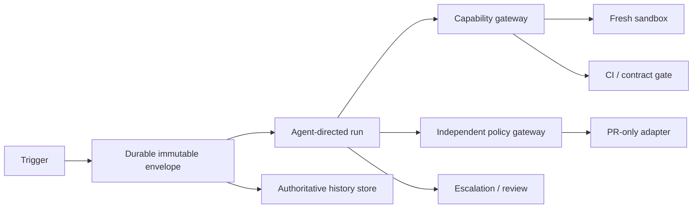

# Agent-Directed Maintenance Run — Architecture

The agent is the control-flow owner (`EP4`): it chooses the entire sequence toward the stated maintenance objective. The workflow role is an externally enforced durable envelope, not a deterministic sequencer.

## Scope

In scope: one envelope-bound objective, fresh sandbox, agent-directed diagnosis/repair/gate loop, one PR, escalation, and durable audit. Out: merge, deploy, production/direct authoritative-repository access, objective widening, and unrestricted tools.

| Actor | Role | Non-negotiable limit |
|---|---|---|
| Agent | Plans, branches, invokes allowed tools, proposes completion/escalation. | Cannot amend envelope or authorise effects. |
| Envelope/runtime | Persists state, accepted transitions, waits, budgets, terminal outcomes. | Does not surrender authoritative state to agent memory. |
| Capability gateway | Enforces sandbox/tool/path/network allow-list. | Deny by default; no direct real-repo write. |
| Policy gateway | Independently admits each `EF2` effect. | Requires envelope, budget, scope and digest evidence. |
| PR adapter | Creates an idempotent PR. | Cannot merge/deploy. |
| Human service | Receives escalation and reviews completed run. | Does not approve an altered digest without new evidence. |

External boundaries are `XB-01` security/privacy, `XB-02` identity/delegation, `XB-03` observability, `XB-04` governance/risk, and `XB-05` evaluation quality.
