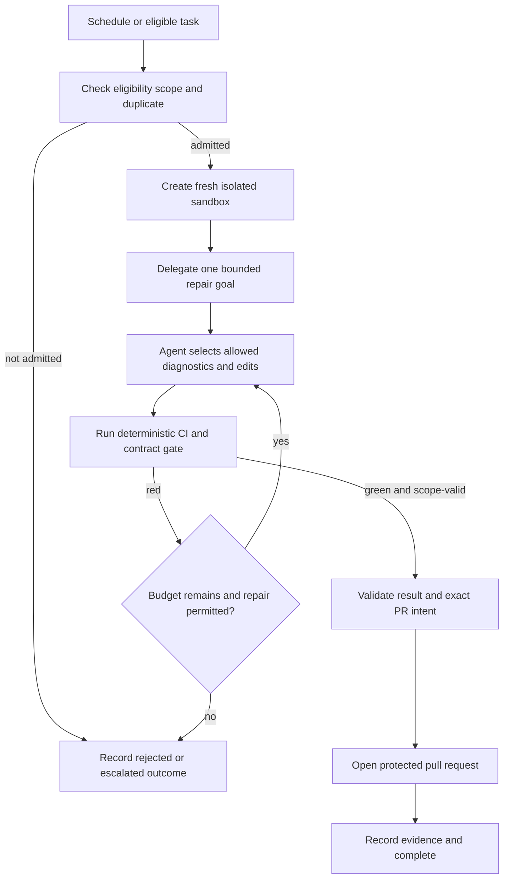

# Autonomous Maintenance Run — Solution

Status: Design example

This is the architecture and result of the [rationale](rationale.md). The machine-readable result is the [WDS](autonomous-maintenance-run.wera.yaml).

## The design in one picture

A scheduled or eligible backlog task is screened by rules. If admitted, the workflow creates a new isolated sandbox and delegates one fenced repair goal. The agent may diagnose, edit, and run allowed tools there; after every attempt the deterministic gate decides whether the change is good enough. Green plus a scope-valid manifest permits a protected PR creation. Red feedback can cause another attempt only while every budget remains; over-scope, repeated failure, or exhausted budget exits safely.

## Result — the WDS

| Field | Value |
|---|---|
| `selected_profile` | `EP3` |
| `selected_pattern` | `WP09` |
| `embedded_patterns` | `WP00`, `WP04` |
| `lifecycle_envelope` | `WP08` |
| `overlays` | `OV-02`, `OV-03`, `OV-04`, `OV-06`, `OV-07` |
| `external_boundaries` | `XB-01`–`XB-05` |
| `readiness_tier` | `RT2` |
| `conformance_target` | `CL2` |

## How effects are protected

A sandbox edit and opening a pull request are reversible writes (`EF2`). Each is protected by `OV-02`’s separation of propose → validate → authorise → execute → confirm → reconcile:

1. the agent proposes a scoped sandbox edit or returns a validated change result;
2. deterministic controls validate the task contract, change manifest, budget, and gate evidence;
3. policy authorises only the predeclared sandbox capability, then only one PR for the exact green change digest;
4. separate constrained adapters execute the sandbox write or PR create;
5. confirmations are linked to the run; and
6. an uncertain write result is reconciled (`OV-03`) rather than blindly retried.

The PR credential cannot merge or deploy. The sandbox credential cannot touch real repository state. The agent has no credential or authority that can bypass either constraint.

## Why this passes conformance

- **Documented (`CL0`):** the descriptor captures run boundary, coordinate, authority allocation, primitive graph, effects, patterns, overlays, boundaries, and terminal outcomes.
- **Invariant-conforming (`CL1`):** deterministic baseline and semantic gap are explicit; all five authorities are allocated; delegation, loops, and budgets are bounded; writes are authorised and idempotent; a single state owner records every accepted transition; untrusted inputs are contained.
- **Overlay-conforming (`CL2`):** protected effects, idempotency/reconciliation, durable waits, budgets, and authoritative execution history are declared and applied.

`RT2` is appropriate only when the deployment supplies the stated preconditions: meaningful deterministic gates, isolated sandboxes, scoped credentials, durable state, and the external boundary controls. A green gate is evidence of the declared contract, not proof that the change is universally correct; task scope and evaluation quality remain key operational controls.

See the [architecture](views/architecture.md), [execution](views/execution.md), [sequence](views/sequence.md), and [contracts and state](views/contracts-and-state.md) views.
