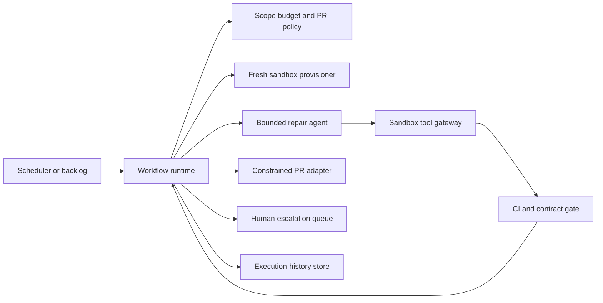

# Autonomous Maintenance Run — Architecture

Status: Design example

The workflow uses `EP3`: a workflow-directed run with one bounded agentic region. In plain terms, rules run the overall job; the agent gets a small fenced workshop in which to repair one task. It can select local steps but cannot select work, expand its powers, or finish the run on its own.

## Scope

**In scope:** one eligible dependency, lint/type, specification, or documentation maintenance task; a fresh sandbox; iterative scoped repair; deterministic CI/contract gate; one PR for the green change; escalation; durable evidence.

**Out of scope:** merging, deployment, production access, direct writes to an authoritative repository, large features, scope expansion, and autonomous task selection.

## Logical architecture

## Actor responsibilities

| Actor | Responsibility | Limit |
|---|---|---|
| Workflow runtime | Selects one task, enforces policy and transitions, delegates/returns the region, waits for CI, creates terminal outcome. | Does not let the agent control the whole run. |
| Scope/budget policy | Admits declared task types, validates change manifest, enforces tool/effect ceilings and budget. | Cannot treat CI log or issue prose as authority. |
| Sandbox provisioner | Creates a fresh isolated environment per run and destroys/discards it at exit. | No direct authoritative-repository mutation. |
| Repair agent | Plans local work, selects allow-listed diagnostics/edits, interprets feedback, and returns result. | Cannot select a new task, broaden scope, merge, deploy, or create a PR directly. |
| Tool gateway | Executes sandbox-local read/write and diagnostic capabilities under scoped credentials. | Enforces allow-list, repository/path/network restrictions, and audit. |
| CI/contract gate | Executes deterministic checks and returns a stable pass/fail result with evidence. | Is the success arbiter, not an instruction source. |
| PR adapter | Creates at most the exact idempotent PR intent after policy admits it. | PR-write-only; no merge/deploy capability. |
| Human escalation queue | Receives over-scope and repeated-failure evidence for disposition. | Does not silently resume a changed task without a new contract. |
| Execution-history store | Records checkpoints, attempts, waits, gate results, effect confirmation, and final outcome. | Links external identities; does not replace Git/CI records. |

Security/privacy (`XB-01`), identity/delegation (`XB-02`), observability (`XB-03`), governance/risk (`XB-04`), and evaluation quality (`XB-05`) remain external boundaries owned by their respective concerns.
