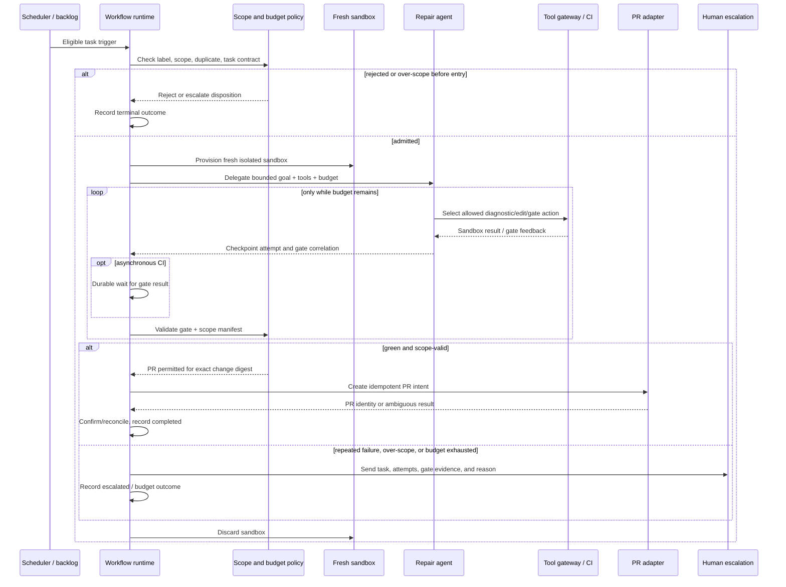

# Autonomous Maintenance Run — Sequence

Status: Design example

## Authority boundary

The repair agent never calls the PR adapter. Its only write capability is a sandbox-local edit under the predeclared fence. A green deterministic gate and a scope-valid manifest return to the workflow, which performs policy authorisation and invokes the separately credentialed PR adapter. This prevents a proposal or a model-generated instruction from becoming an externally visible effect without validation, authorisation, and confirmation.
