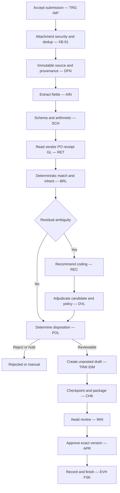

# Invoice Processing — Architecture

Status: Mature worked example

*This is a **detailed view** of the [solution](solution.md). It shows where this workflow sits, what is in and out of scope, the logical pipeline, and who is responsible for what.*

## Architectural position

This workflow runs under profile `EP2` — workflow-directed and model-assisted. The workflow runtime holds control-flow, decision, and state authority throughout the run. Models are used only inside bounded steps and only ever **propose**: the extraction model proposes fields (validated by `SCH`), and the recommendation model proposes a coding selection from a bounded candidate set (adjudicated by `DVL` and `POL`). No model holds control-flow, decision, action-authorisation, execution, or state authority ([INV-006](../../foundations/architecture-invariants.md), [INV-007](../../foundations/architecture-invariants.md)).

The deterministic baseline `WP00` resolves the normal path; the recommendation model is reached only for residual lines that rules cannot settle. This keeps the design least-agentic ([DP-01](../../foundations/design-principles.md)) while still closing the two genuine semantic gaps.

## Scope

**In scope**

- Accepting an invoice submission and enforcing input and attachment controls (`XB-01`).
- Extraction of header and line data as `AIN` validated by `SCH` (`WP01`).
- Deterministic validation, reference-data lookups, matching, tolerance checks, receipt matching, PO coding inheritance, and duplicate detection (`WP00`).
- Recommending coding for residual lines over a bounded, validated candidate set, with abstention via `UNC` (`WP02`).
- Creating an **unposted** ERP draft as a reversible write `TRW` at `EF2`, protected by the `OV-02` six-role separation and made idempotent by `IDM`.
- A human approval gate binding the exact draft version (`WP07` / `OV-01`).
- Durable, resumable state across the review wait (`WP08`) with `EVH` execution history as system of record (`OV-07`).

**Out of scope**

- Posting the draft to the ledger, payment scheduling, and payment release. Posting/payment is a **later** `EF3`/`EF4` concern and is not performed here.
- Vendor-master or banking changes; PO creation or modification.
- Autonomous posting or agent self-approval.
- Unrestricted ERP access; the adapter uses constrained credentials scoped to draft creation only.

Approval authorises a specific unposted draft version. It does **not** authorise payment.

## Logical architecture

## Actor responsibilities

| Actor | Responsibility | Explicit limits |
|---|---|---|
| Workflow runtime | Holds control-flow, sequencing, and disposition logic; drives every transition; owns the run lifecycle. | Never delegates decision or state authority to a model; does not itself write to the ERP. |
| Extraction model | Proposes header and line fields from the untrusted document as `AIN`. | Output is untrusted until `SCH` validates it; holds no authority; cannot trigger effects. |
| Recommendation model | Proposes a coding **selection** from a bounded, validated candidate set via `REC`; may signal abstention through `UNC`. | Selects only; never generates free-form accounts; never calls the ERP executor; holds none of the five authorities ([INV-009](../../foundations/architecture-invariants.md)). |
| Deterministic validation | Runs `WP00` baseline and `DVL` adjudication: schema, arithmetic, matching, tolerances, candidate membership, active accounts, dimensions. | Applies rules only; does not invent data; rejects or routes rather than guessing. |
| Policy and authorisation | `POL` determines disposition and authorises creation of an unposted draft. | Authorises a draft, never a posting or payment; cannot override the reviewer or self-approve. |
| ERP adapter | Executes the `TRW` draft creation with `IDM` and constrained credentials; confirms draft identity/version. | Creates unposted drafts only; ambiguous results trigger `RCP`, never a blind retry ([INV-011](../../foundations/architecture-invariants.md)); no posting or payment scope. |
| AP reviewer | Approves, rejects, requests change, or lets the gate time out on the exact draft version and digest (`APR`, `WP07`). | Binds one exact version ([INV-013](../../foundations/architecture-invariants.md)); cannot approve a version they did not see; approval does not authorise payment. |
| Workflow state store | Records authoritative run state and `EVH` execution history as the system of record (`OV-07`); enables durable resume via `CHK`. | Links to (does not duplicate) the ERP draft identity ([INV-002](../../foundations/architecture-invariants.md)); is not a shadow ledger. |

## Related views

- [execution.md](execution.md) — stage-by-stage walkthrough.
- [sequence.md](sequence.md) — interaction sequence.
- [contracts-and-state.md](contracts-and-state.md) — contracts and state checkpoints.
