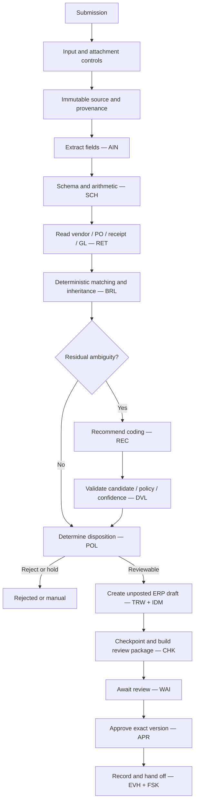

# Invoice Processing — Solution

Status: Mature worked example

*This is the **Architecture + Result**: the design the [rationale](rationale.md) produced, and the machine-readable WDS it maps to.*

## The design in one picture

## Result — the WDS

The complete, schema-valid Workflow Design Specification is:

**[descriptor/examples/invoice-processing.wera.yaml](invoice-processing.wera.yaml)**

Key resolved values:

| Field | Value |
|---|---|
| `selected_profile` | `EP2` |
| `selected_pattern` | `WP02` |
| `embedded_patterns` | `WP00`, `WP01`, `WP07` |
| `lifecycle_envelope` | `WP08` |
| `overlays` | `OV-01`, `OV-02`, `OV-07` |
| `external_boundaries` | `XB-01`, `XB-02`, `XB-03`, `XB-04` |
| `readiness_tier` | `RT2` |
| `conformance_target` | `CL2` |

## How the effect is protected

Creating the unposted draft follows the [`OV-02`](../../ra/06-overlays/workflow-overlays.md) six-role separation:

1. **propose** — deterministic controls assemble the exact payload from the validated coding;
2. **validate** — `DVL` checks candidate membership, active accounts, dimensions, policy;
3. **authorise** — `POL` permits an unposted draft (not a posting);
4. **execute** — the ERP adapter creates the draft with an idempotency key and constrained credentials;
5. **confirm** — the ERP draft identity/version is linked to the run;
6. **reconcile** — an ambiguous result triggers `RCP`, never a blind retry.

The recommendation model never calls the ERP directly ([INV-009](../../ra/01-foundations/architecture-invariants.md), [INV-010](../../ra/01-foundations/architecture-invariants.md)).

## Why this passes conformance

- `CL0` — the descriptor is schema-valid.
- `CL1` — invariants and composition rules hold (baseline documented, proposals validated, effect protected, approval version-bound, no self-approval).
- `CL2` — every triggered overlay (`OV-01`/`OV-02`/`OV-07`) is applied and every touched boundary (`XB-01`–`XB-04`) is declared.

Readiness `RT2` is met by protected effects, a system of record (`RC-10`), reconciliation for the write, and human approval.

## Detailed views

For depth, see [architecture](views/architecture.md), [execution](views/execution.md), [sequence](views/sequence.md), and [contracts-and-state](views/contracts-and-state.md).
