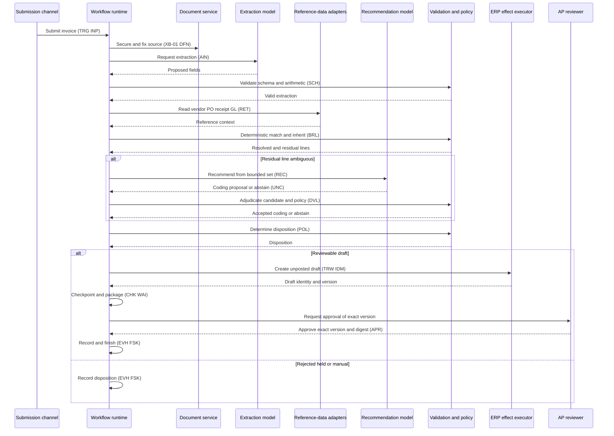

# Invoice Processing — Sequence

Status: Mature worked example

*This is a **detailed view** of the [solution](../solution.md). It shows the interaction sequence across participants, including the ambiguous-line and reviewable-draft branches.*

## Interaction sequence

## Important boundary

The recommendation model never talks to the ERP effect executor directly. Every proposal returns to the workflow runtime, is adjudicated by validation and policy (`DVL`, `POL`), and only then does the workflow — under authorisation — instruct the ERP effect executor to create the unposted draft. This preserves the `OV-02` propose→validate→authorise→execute→confirm→reconcile separation and keeps all five authorities away from the model ([INV-009](../../../ra/01-foundations/architecture-invariants.md), [INV-010](../../../ra/01-foundations/architecture-invariants.md)). The draft creation is a reversible `EF2` write of an unposted draft; posting and payment are out of scope. Approval binds the exact draft version and does **not** authorise payment.

## Related views

- [architecture.md](architecture.md) — logical architecture and actors.
- [execution.md](execution.md) — stage-by-stage walkthrough.
- [contracts-and-state.md](contracts-and-state.md) — contracts and state checkpoints.
