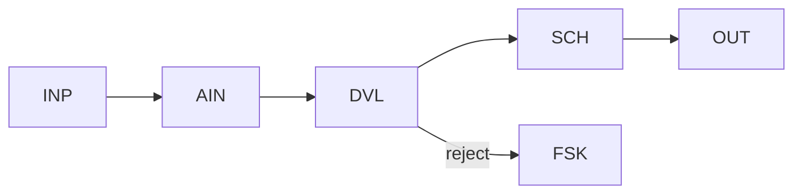

# WP01 — Bounded Model Step

Status: Mature

## Problem
A single step needs one unit of inference — extract, classify, or generate a
value — but the surrounding workflow must stay predictable. Left unbounded, a
model call produces free-form output that later steps cannot safely consume.
This pattern confines one semantic primitive under a fixed contract and
validates its output before any downstream use.

## When to use / not use
- Use for exactly one semantic unit of work with a declared input/output contract.
- Use when the output can be validated against a schema or closed set.
- Do not use when several inference steps chain together (compose smaller
  WP01 steps, or escalate to a richer pattern).
- Do not use when no deterministic check on the output is possible.

## Structure
Typed input is bound, a single semantic primitive runs under a declared
contract, and its result MUST pass validation before it is admitted to state.



## Primitives
- `INP` — typed input binding and the declared contract.
- `AIN` / `CLS` / `GEN` — the single semantic unit (extract, classify, generate).
- `DVL` — validate the proposed output against the contract.
- `SCH` — schema conformance of the accepted value.
- `FSK` — fail-safe/known outcome when validation rejects.
- `OUT` — typed output admitted to state.

## Authority allocation
| Authority | Holder |
|---|---|
| Control-flow | workflow |
| Decision | model proposes, workflow admits |
| Action-authorisation | workflow |
| Execution | workflow |
| State | workflow |

## Invariants and rules
- INV-001 — nondeterminism is declared: the contract states the model's role.
- INV-009 — the model output is a proposal, not an effect, until validated.
- INV-005 — accepted and rejected outcomes are distinguishable.
- INV-018 — untrusted model/input content is contained behind validation.
- DP-03 — smallest semantic task; DP-05 — proposals validated before state.

## Coordinates
```yaml
nondeterminism: ND1
control_flow_authority: workflow
actor_topology: single_agent
flow_shape: FS1
durability: DUR1
effect_level: EF1
assurance: AS1
impact: IM1
```

## Failure modes
- Contract too loose: validation passes malformed-but-schema-valid output.
- Silent acceptance if `DVL` is skipped and output flows straight to state.
- Retry storms when a hard-to-satisfy contract repeatedly rejects.

## Consequences
- Benefits: inference is available without leaking nondeterminism downstream.
- Benefits: a clear, testable boundary around one model call.
- Costs: requires a validatable contract; not every task has one.

## Example
In [invoice processing](../examples/invoice-processing/README.md), header and
line-item field extraction runs as a single `AIN` step under a fixed field
contract; the extracted values MUST pass `SCH` validation (types, required
fields, totals shape) before they are admitted. Anything failing validation is
routed to a fail-safe outcome rather than propagated.
