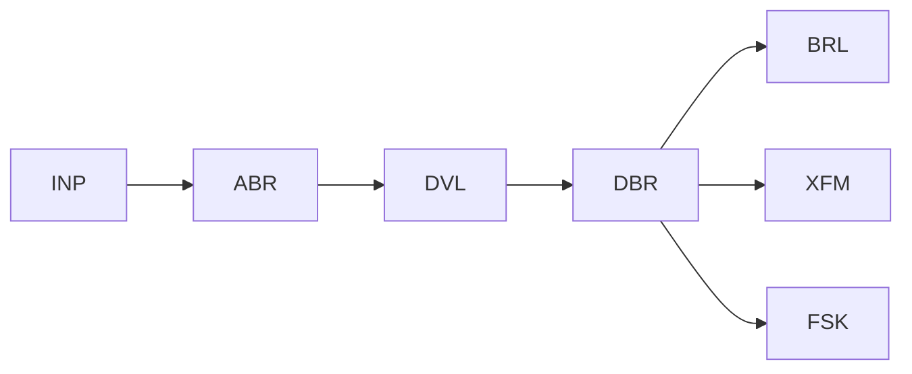

# WP03 — Model-Selected Deterministic Branch

Status: Proposal

## Problem
A workflow has several fully deterministic branches and needs the model only to
choose which one to take, based on input the model reads better than fixed
rules. The branch bodies themselves must stay deterministic; only the selection
is inferred. This pattern isolates that selection so nondeterminism does not
leak into the branch logic.

## Candidate structure
Typed input feeds an agentic branch selector that chooses from a closed set of
branch keys; the choice is validated for membership, then a deterministic
branch executes the selected path. The selector proposes; the workflow routes.



- `INP` binds input and the closed branch set.
- `ABR` selects one branch key from that set.
- `DVL` confirms the key is a member of the closed set.
- `DBR` performs the deterministic routing; each branch is `BRL`/`XFM`.
- `FSK` is the fail-safe branch for an inadmissible selection.

## Typical coordinates
```yaml
nondeterminism: ND4
control_flow_authority: workflow
actor_topology: single_agent
flow_shape: FS3
durability: DUR1
effect_level: EF1
assurance: AS1
impact: IM2
```

## Relationship to other patterns
- Sits one step above [WP02](wp02-recommend-adjudicate.md): WP02 recommends a
  value adjudicated by policy, whereas WP03 selects a control-flow branch.
- Differs from [WP00](wp00-deterministic-baseline.md) only in that branch
  selection is inferred rather than rule-driven; the branch bodies are WP00.
- Composes inside [WP08](wp08-durable-workflow-envelope.md) when branches are
  long-running, and can gate a branch with [WP07](wp07-human-supervised-action.md).

## Open questions
- How should confidence in the selection be represented and thresholded before
  falling back to `FSK`?
- Should the closed branch set be versioned like effect artifacts (INV-012), and
  how are additions governed?
- When branches diverge in effect level, does selection authority need the same
  protection as an action authorisation?
- Is a deterministic tie-break required when the selector is ambiguous, and who
  owns it?
- How does this differ operationally from encoding the selection as a WP02
  recommendation over branch keys?
