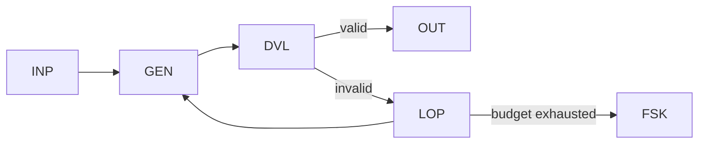

# WP04 — Generate-Validate-Repair

Status: Mature

## Problem
Generated artifacts often fail validation on the first attempt but can be fixed
with targeted feedback. A single generate-then-check step discards that
opportunity, while an unbounded repair loop risks running forever or burning
budget. This pattern is a bounded generate/validate/repair cycle.

## Structure
The model generates a candidate, deterministic validation checks it, and on
failure a bounded repair loop feeds the validation errors back for another
attempt. The loop terminates on success, on exhausting a retry bound, or on a
fail-safe outcome.



- `INP` binds input and the output contract.
- `GEN` produces a candidate artifact.
- `DVL` / `SCH` validate against the contract.
- `LOP` bounds repair iterations and carries error feedback.
- `RTY` expresses the per-attempt retry semantics; `FSK` is the exhausted outcome.

## Typical coordinates
```yaml
nondeterminism: ND2
control_flow_authority: workflow
actor_topology: single_agent
flow_shape: FS4
durability: DUR1
effect_level: EF1
assurance: AS1
impact: IM1
```

## Relationship to other patterns
- Extends [WP01](wp01-bounded-model-step.md) by adding a bounded repair loop
  around the single model step.
- The successful artifact can feed [WP07](wp07-human-supervised-action.md) for
  approval, or [WP02](wp02-recommend-adjudicate.md) when repair targets a
  closed candidate set.
- Iteration budgets align with the budget/quota overlay (OV-06).
- Generalised from "validate an artifact" to "make a deterministic gate pass," and
  hosted inside a [WP09](wp09-bounded-agentic-region.md) region, this is the
  convergence loop of an agent-directed run (see example).

## Example
The [autonomous maintenance run](../descriptor/examples/autonomous-maintenance-run.wera.yaml)
is WP04 with the validator generalised to a CI/contract gate: the agent applies a
change (`GEN`/`TRW`), the gate runs (`DVL`), and on red the bounded loop (`LOP`) feeds
the gate's output back for another attempt until the gate goes green or the budget
(`OV-06`) trips `FSK`. This is what a use-case catalogue might call an "autonomous
convergence loop" — in WERA it is WP04's loop shape (`FS4`) under agent control-flow,
not a separate pattern.

## Termination and safety
The loop's termination stays deterministic even though generation is not:

- **Bound** — the iteration ceiling is a budget ([OV-06](../overlays/workflow-overlays.md))
  expressed in whichever dimension bites first (attempts, tokens, wall-clock); a fixed
  count is the weakest form and should be a fallback, not the only bound.
- **Deterministic arbiter** — `DVL`/`SCH` (or an external gate) is the sole judge of
  success. When the check is itself probabilistic, it must be reduced to a
  deterministic threshold before it can terminate the loop.
- **Contained feedback** — repair feedback is treated as untrusted per
  [INV-018](../foundations/architecture-invariants.md); it may carry validator output
  but must not widen the input contract bound at `INP`.
- **Audit** — the final outcome is always recorded (`EVH`); individual attempts are
  checkpointed (`CHK`) when partial progress must survive a restart, which pulls the
  loop into a [WP08](wp08-durable-workflow-envelope.md) envelope.
