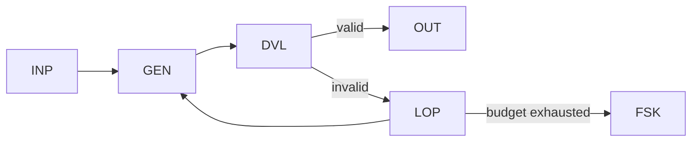

# WP04 — Generate-Validate-Repair

Status: Proposal

## Problem
Generated artifacts often fail validation on the first attempt but can be fixed
with targeted feedback. A single generate-then-check step discards that
opportunity, while an unbounded repair loop risks running forever or burning
budget. This pattern proposes a bounded generate/validate/repair cycle.

## Candidate structure
The model generates a candidate, deterministic validation checks it, and on
failure a bounded repair loop feeds the validation errors back for another
attempt. The loop terminates on success, on exhausting a retry bound, or on a
fail-safe outcome.



- `INP` binds input and the output contract.
- `GEN` produces a candidate artifact.
- `DVL` / `SCH` validate against the contract.
- `LOP` bounds repair iterations and carries error feedback.
- `RTY` expresses the per-attempt retry semantics; `FSK` is the exhausted outcome.

## Typical coordinates
```yaml
nondeterminism: ND2
control_flow_authority: workflow
actor_topology: single_agent
flow_shape: FS4
durability: DUR1
effect_level: EF1
assurance: AS1
impact: IM1
```

## Relationship to other patterns
- Extends [WP01](wp01-bounded-model-step.md) by adding a bounded repair loop
  around the single model step.
- The successful artifact can feed [WP07](wp07-human-supervised-action.md) for
  approval, or [WP02](wp02-recommend-adjudicate.md) when repair targets a
  closed candidate set.
- Iteration budgets align with the budget/quota overlay (OV-06).

## Open questions
- What is the right default iteration bound, and should it be time- or
  cost-based rather than a fixed count?
- How should repair feedback be constrained so it cannot smuggle in untrusted
  content past INV-018?
- Does each repair attempt need its own audit record, or only the final outcome?
- When validation is itself probabilistic, how do we keep the loop's termination
  deterministic?
- Should partial-progress across attempts be checkpointed, pulling this into
  [WP08](wp08-durable-workflow-envelope.md)?
