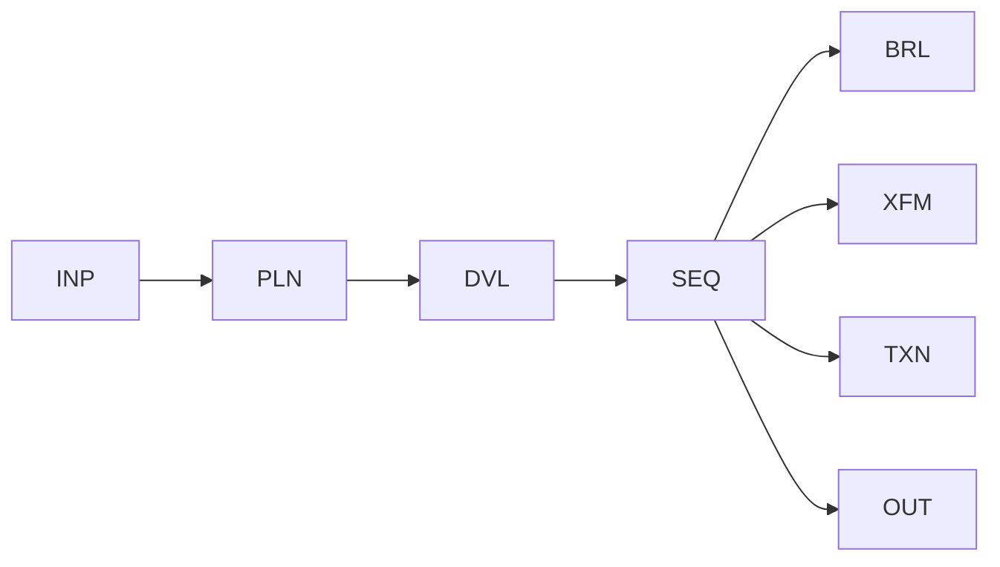

# WP05 — Bounded Plan + Deterministic Execute

Status: Proposal

## Problem
Some tasks need the model to compose a sequence of steps, but letting the model
both plan and act removes the workflow's control over what actually runs. If the
plan is open-ended, effects become unpredictable. This pattern proposes having
the model produce a bounded plan that deterministic machinery then executes
step by step.

## Candidate structure
The model produces a plan drawn from a closed step vocabulary and within an
explicit budget; the plan is validated, then each step executes deterministically
under workflow control. The model does not execute; it only plans.



- `INP` binds the goal, the closed step vocabulary, and the budget.
- `PLN` produces a bounded, ordered plan over that vocabulary.
- `DVL` validates step membership, ordering, and budget conformance.
- `SEQ` executes each step deterministically (`BRL`/`XFM`/`TXN`).

## Typical coordinates
```yaml
nondeterminism: ND6
control_flow_authority: workflow
actor_topology: single_agent
flow_shape: FS2
durability: DUR2
effect_level: EF3
assurance: AS2
impact: IM3
```

## Relationship to other patterns
- Generalises [WP03](wp03-model-selected-branch.md) from selecting one branch to
  ordering several deterministic steps.
- Effectful steps in the plan SHOULD be protected via
  [WP07](wp07-human-supervised-action.md); long plans wrap into
  [WP08](wp08-durable-workflow-envelope.md).
- Budgets follow the budget/quota overlay (OV-06); this stops short of the
  agentic action-selection in [WP09](wp09-bounded-agentic-region.md).

## Open questions
- What is the closed step vocabulary's scope, and how is it versioned and
  governed (INV-012)?
- Should the plan be re-validated between steps if earlier steps change state?
- How are budgets allocated across plan length, per-step cost, and total effect?
- When a mid-plan step fails, does execution repair (WP04-style), compensate
  (OV-05), or abort to fail-safe?
- Where is the line between a bounded plan here and open action-selection that
  belongs in WP09?
