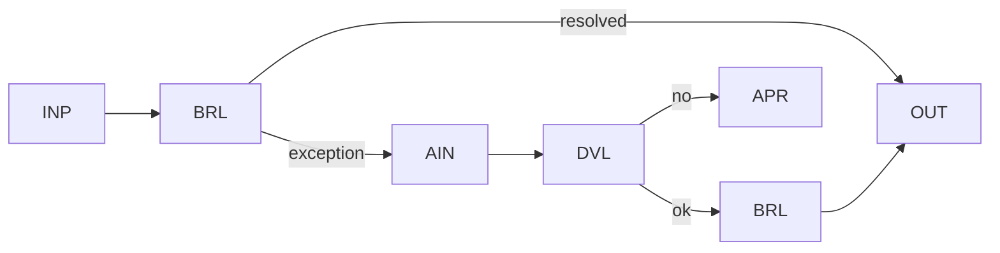

# WP06 — Model-Assisted Exception Handling

Status: Proposal

## Problem
Well-modeled workflows resolve most cases deterministically, but a minority of
exceptions fall outside the rules and would otherwise require manual triage.
Invoking the model on every case wastes cost and adds nondeterminism where none
is needed. This pattern proposes keeping a deterministic happy path and calling
the model only on the exception branch.

## Candidate structure
The deterministic path handles the common case end to end. Only when a case
fails deterministic resolution does control enter an exception branch where a
bounded model step proposes a resolution, which is then validated and either
applied or escalated.



- `BRL` is the deterministic happy path.
- The exception branch invokes a bounded semantic step (`AIN`/`CLS`/`GEN`).
- `DVL` validates the proposed resolution.
- `APR`/`HRV` escalates to a human when the model cannot resolve.

## Typical coordinates
```yaml
nondeterminism: ND2
control_flow_authority: workflow
actor_topology: single_agent
flow_shape: FS6
durability: DUR2
effect_level: EF2
assurance: AS2
impact: IM2
```

## Relationship to other patterns
- The exception branch is a [WP01](wp01-bounded-model-step.md) step; the happy
  path is [WP00](wp00-deterministic-baseline.md).
- Escalation reuses [WP07](wp07-human-supervised-action.md) for human handling.
- Embodies DP-02 and DP-01: deterministic baseline first, least-agentic
  composition, with inference confined to where rules run out.

## Open questions
- How is the boundary between "resolvable exception" and "must escalate" defined
  and kept from drifting?
- Should exception handling feed learnings back into the deterministic rule set,
  and how is that governed?
- What observability distinguishes genuine exceptions from silent happy-path
  degradation?
- How do we prevent the exception branch from quietly becoming the main path
  over time?
- Does the exception branch need its own budget separate from the overall run
  (OV-06)?
