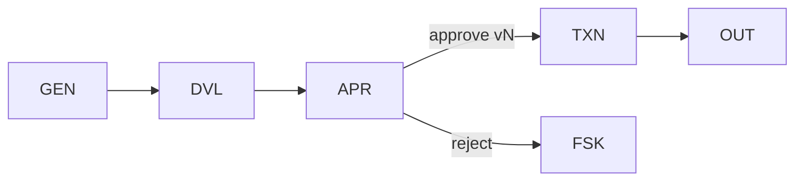

# WP07 — Human-Supervised Action

Status: Mature

## Problem
Some effects are material enough that a person must approve them before they
occur, and the approval must bind the exact artifact that will be executed —
not a stale or different version. Without a version-bound gate, a reviewer can
approve one draft while a different one is posted. This pattern places a human
approval gate immediately before a protected effect.

## When to use / not use
- Use when an effect requires human authorisation before execution.
- Use when the approved artifact must be pinned to an exact version.
- Do not use for reversible, low-impact effects where approval adds only latency.
- Do not use as a substitute for validation — approval follows validation.

## Structure
A validated draft is presented for approval; the approval binds the exact
version; only an explicit approve outcome releases the protected effect, and
the proposer is not the authoriser.



## Primitives
- `GEN` / `REC` — produces the draft artifact.
- `DVL` — validates the draft before it is offered for approval.
- `APR` — human approval gate binding an exact version.
- `TXN` — the protected, transactional effect released on approval.
- `FSK` — fail-safe/rejected outcome.
- `AUD` — audit record of who approved which version.

## Authority allocation
| Authority | Holder |
|---|---|
| Control-flow | workflow |
| Decision | model/workflow proposes |
| Action-authorisation | human |
| Execution | workflow (on approval) |
| State | workflow |

## Invariants and rules
- INV-007 — no self-authorised effects: proposer MUST NOT be the authoriser.
- INV-013 — approval binds the exact version that will execute.
- INV-014 — approval outcomes (approve/reject) are explicit and recorded.
- INV-009 — the draft is a proposal until approved.
- OV-01 — human-approval overlay; DP-06 — protect effects proportionally.

## Coordinates
```yaml
nondeterminism: ND1
control_flow_authority: human
actor_topology: single_agent
flow_shape: FS7
durability: DUR2
effect_level: EF3
assurance: AS4
impact: IM3
```

## Failure modes
- Version drift: the executed artifact differs from the approved version.
- Self-approval: proposer and authoriser collapse to one identity.
- Rubber-stamping: approval UI hides material change from the reviewer.

## Consequences
- Benefits: a person authorises material effects against an exact artifact.
- Benefits: clean audit trail of approver, version, and outcome.
- Costs: introduces a human-latency wait (often paired with [WP08](wp08-durable-workflow-envelope.md)).

## Example
In [invoice processing](../examples/invoice-processing/README.md), an accounts-
payable reviewer approves the exact unposted draft version of the invoice
posting. The `APR` gate binds that version digest; only an explicit approval
releases the `TXN` posting, the approving identity differs from the proposer,
and both the version and the decision are recorded in `AUD`.
