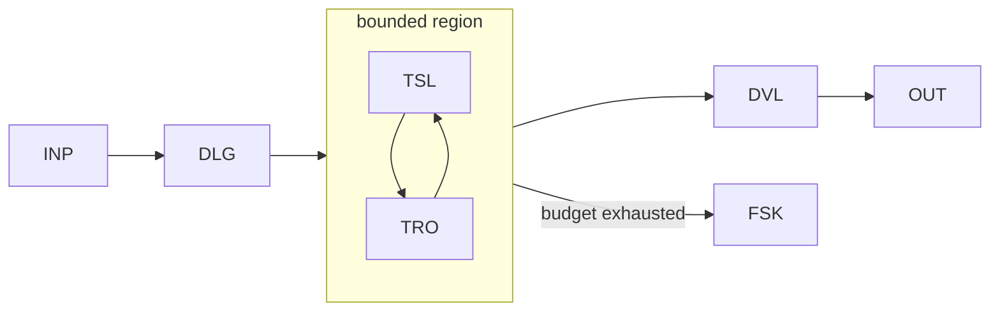

# WP09 — Bounded Agentic Region

Status: Mature

## Problem
Some goals genuinely need an agent to choose actions dynamically rather than
follow a fixed plan, but unbounded agency is unpredictable and unsafe for
effects. The challenge is to grant real action-selection while keeping the region
contained, budgeted, and answerable to the workflow. This pattern grants a
delegated goal executed inside an explicitly bounded agentic region.

## Structure
The workflow delegates a goal to an agent under a contract that fixes the
available tools, the budget, and the region boundary. Inside, the agent selects
tools dynamically; on exit it returns a validated result to the workflow, which
retains state and coordination authority.



- `DLG` delegates a goal under a bounded contract.
- `TSL` is the agent's dynamic tool/action selection.
- `TRO`/`TRW`/`THI` are the constrained tools available in the region.
- `DVL` validates the region's result before it re-enters workflow state.
- `FSK` is the bounded fail-safe when budget or boundary is hit.

## Typical coordinates
```yaml
nondeterminism: ND5
control_flow_authority: agent
actor_topology: bounded_agentic_region
flow_shape: FS4
durability: DUR2
effect_level: EF2
assurance: AS2
impact: IM2
```

## Relationship to other patterns
- Escalates beyond [WP05](wp05-bounded-plan-execute.md): the agent selects
  actions at runtime rather than executing a pre-validated plan.
- The region MUST be wrapped by [WP08](wp08-durable-workflow-envelope.md) for
  durability, and effectful tools protected via [WP07](wp07-human-supervised-action.md).
- Multiple such regions compose into [WP10](wp10-multi-agent-delegation.md).

## Example
The [autonomous maintenance run](../descriptor/examples/autonomous-maintenance-run.wera.yaml)
("night shift") is a WP09 region: the workflow delegates one bounded maintenance
task (`DLG`), the agent selects edits and tools (`TSL`) inside an ephemeral sandbox
with scoped credentials, and the region's result — a change that makes a
deterministic gate go green — is validated (`DVL`) before a pull request is opened.
Budget exhaustion (`OV-06`) is the fail-safe exit (`FSK`). The run's own WDS embeds
the repair loop as [WP04](wp04-generate-validate-repair.md) and wraps the region in
[WP08](wp08-durable-workflow-envelope.md), showing how WP09 composes in practice.

## Boundary contract
The region boundary is the enforceable object that makes [INV-008 (bounded
delegation)](../foundations/architecture-invariants.md) checkable rather than
aspirational. A conforming region declares, before entry:

- **Goal spec** — the single delegated objective and its result schema (`DVL` at exit).
- **Tool allow-list** — the exact `TRO`/`TRW`/`THI` capabilities available inside,
  with credentials constrained per [INV-010](../foundations/architecture-invariants.md).
- **Budget** — step, token, wall-clock, and effect-count ceilings, owned by
  [OV-06](../overlays/workflow-overlays.md); the first ceiling hit forces `FSK`.
- **Effect ceiling** — the highest `EFn` the agent may cause unescalated; anything
  above escalates to [OV-01](../overlays/workflow-overlays.md) rather than proceeding.

Entry and exit are always audited; intra-region tool calls are audited when they
cause effects (`EF1`+), and may be sampled otherwise. A **clean exit** returns a
schema-valid result within budget; an **abort** is any budget/boundary breach and is
reconciled via [OV-03](../overlays/workflow-overlays.md) (discard or compensate partial
work). Nesting a region inside a region is permitted only if the inner budget and
effect ceiling are strictly contained by the outer; beyond one level the run is really
[EP4](../profiles/ep4-agent-directed.md).
