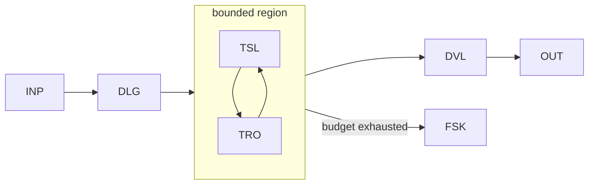

# WP09 — Bounded Agentic Region

Status: Proposal

## Problem
Some goals genuinely need an agent to choose actions dynamically rather than
follow a fixed plan, but unbounded agency is unpredictable and unsafe for
effects. The challenge is to grant real action-selection while keeping the region
contained, budgeted, and answerable to the workflow. This pattern proposes a
delegated goal executed inside an explicitly bounded agentic region.

## Candidate structure
The workflow delegates a goal to an agent under a contract that fixes the
available tools, the budget, and the region boundary. Inside, the agent selects
tools dynamically; on exit it returns a validated result to the workflow, which
retains state and coordination authority.



- `DLG` delegates a goal under a bounded contract.
- `TSL` is the agent's dynamic tool/action selection.
- `TRO`/`TRW`/`THI` are the constrained tools available in the region.
- `DVL` validates the region's result before it re-enters workflow state.
- `FSK` is the bounded fail-safe when budget or boundary is hit.

## Typical coordinates
```yaml
nondeterminism: ND5
control_flow_authority: agent
actor_topology: bounded_agentic_region
flow_shape: FS4
durability: DUR2
effect_level: EF2
assurance: AS2
impact: IM2
```

## Relationship to other patterns
- Escalates beyond [WP05](wp05-bounded-plan-execute.md): the agent selects
  actions at runtime rather than executing a pre-validated plan.
- The region MUST be wrapped by [WP08](wp08-durable-workflow-envelope.md) for
  durability, and effectful tools protected via [WP07](wp07-human-supervised-action.md).
- Multiple such regions compose into [WP10](wp10-multi-agent-delegation.md).

## Open questions
- How is the region boundary specified so INV-008 (bounded delegation) is
  machine-checkable, not just documented?
- What budget dimensions (steps, tokens, wall-clock, effect count) bound the
  region, and how do they interact (OV-06)?
- How are in-region tool credentials constrained (INV-010) without breaking the
  agent's ability to make progress?
- Should intra-region tool calls be individually audited, or only the region's
  entry and exit?
- What defines a "clean" exit versus an abort, and how is partial work reconciled
  (OV-03)?
