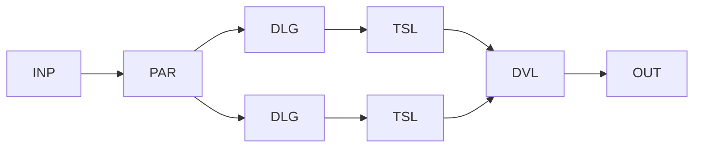

# WP10 — Multi-Agent Delegation

Status: Proposal

## Problem
Some workflows decompose into sub-goals that different specialised agents handle
better than one generalist. Coordinating several agents raises questions of who
owns state, how results merge, and how delegation stays bounded across all of
them. This pattern proposes multiple bounded agentic regions coordinated by a
workflow that retains overall authority.

## Candidate structure
The workflow delegates distinct sub-goals to multiple agents, each running inside
its own bounded region. Regions may run in parallel or in sequence; the workflow
collects and validates each result and remains the sole coordinator and state
owner. No agent delegates to another without going through the workflow.



- `PAR` fans out sub-goals to independent regions.
- Each `DLG`/`TSL` is a bounded agentic region as in [WP09](wp09-bounded-agentic-region.md).
- `DVL` validates and merges each region's result.
- The workflow owns coordination, merge, and state.

## Typical coordinates
```yaml
nondeterminism: ND7
control_flow_authority: workflow
actor_topology: multi_agent
flow_shape: FS5
durability: DUR3
effect_level: EF2
assurance: AS3
impact: IM3
```

## Relationship to other patterns
- Composes several [WP09](wp09-bounded-agentic-region.md) regions under one
  coordinator; each region keeps its own bounds and budget.
- Parallel fan-out/join typically runs inside
  [WP08](wp08-durable-workflow-envelope.md) for durability.
- Differs from [WP11](wp11-cross-runtime-handoff.md), where delegation crosses a
  runtime boundary rather than staying within one coordinator.

## Open questions
- Does control-flow authority stay with the workflow, or can a lead agent hold
  bounded coordination authority (INV-006)?
- How are conflicting or overlapping results from parallel regions reconciled
  deterministically?
- How are budgets partitioned and enforced across regions versus the whole run
  (OV-06)?
- What prevents implicit agent-to-agent delegation that would bypass the
  coordinator and INV-008?
- How is shared state isolated so one region's partial work cannot corrupt
  another's (INV-002)?
