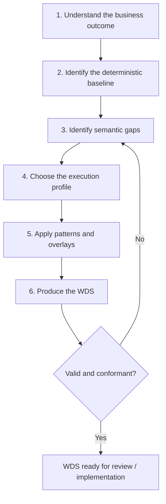

# Workflow Design Method (WDM)

Status: Mature

## What this is

The **Workflow Design Method** is the single "how to use this repository" procedure. It is the spine that both a human architect and an AI agent follow to turn a business use case into a [Workflow Design Specification (WDS)](../descriptor/README.md). It is not more reference architecture — it is how you *apply* the reference architecture.

The same six steps produce the same artifact regardless of who runs them. That property is the [acceptance test](../docs/acceptance-test.md).

## Step 1 — Understand the business outcome

Define the intended outcome and the **workflow-run boundary**: what starts the run and the closed set of terminal outcomes ([INV-004](../foundations/architecture-invariants.md), [INV-005](../foundations/architecture-invariants.md)). Name the authoritative decision owner and the single system of record ([INV-002](../foundations/architecture-invariants.md)).

*Fills:* `workflow`, `intake.inputs`, `intake.operations` in the descriptor.

## Step 2 — Identify the deterministic baseline

Describe how much of the outcome explicit rules, code, lookups, and conventional workflow logic can achieve **without any model** ([DP-02](../foundations/design-principles.md)). This is the floor ([WP00](../patterns/wp00-deterministic-baseline.md)). Most workflows resolve most of their work here.

## Step 3 — Identify semantic gaps

Find the residual tasks that genuinely need a model or agent, and name the **smallest** such task ([DP-03](../foundations/design-principles.md)). For each, answer the [wizard questions](../selection/wizard-questions.md) to set the [coordinate axes](../model/classification.md): locus of nondeterminism, whether the decision space is closed, whether tools/actions are selected, and the effect level.

*Fills:* `intake.nondeterminism`, `intake.requested_authority`, `intake.assurance`, `intake.side_effects`, most of `design.coordinates`.

## Step 4 — Choose the execution profile

From the coordinate, choose the [profile](../profiles/README.md) that describes the whole run's authority arrangement (`EP1`–`EP7`), and allocate all five authorities explicitly ([DP-04](../foundations/design-principles.md), [INV-006](../foundations/architecture-invariants.md)). Use the least-agentic profile that fits ([DP-01](../foundations/design-principles.md)).

*Fills:* `design.selected_profile`, `design.authority_allocation`.

## Step 5 — Apply patterns and overlays

Select the primary [pattern](../patterns/README.md) and any embedded patterns from the coordinate (see [pattern-coordinates](../selection/pattern-coordinates.md)), then attach the triggered [overlays](../overlays/workflow-overlays.md) and declare touched [external boundaries](../overlays/external-boundaries.md). Reuse existing patterns; if you must introduce something new, justify why the existing concepts were insufficient ([DP-10](../foundations/design-principles.md)). Build the primitive graph from the [catalog](../model/primitive-catalog.md), respecting the [composition rules](../model/composition-rules.md).

*Fills:* `design.selected_pattern`, `embedded_patterns`, `lifecycle_envelope`, `overlays`, `external_boundaries`, `primitive_graph`, `effects`, `runtime_components`.

## Step 6 — Produce the WDS

Assemble the [descriptor](../descriptor/README.md) (`*.wera.yaml`), set the `readiness_tier` and `conformance_target`, and write the `recommendation` (baseline, agent justification, alternatives rejected). Validate against the [schema](../descriptor/workflow-descriptor.schema.json) and check [conformance](../readiness/conformance.md). If validation or conformance fails, return to Step 3.

*Produces:* a complete, schema-valid WDS.

## Worked run of the method

The [invoice-processing example](../examples/invoice-processing/README.md) shows all six steps applied end to end, and its [solution](../examples/invoice-processing/solution.md) links to the resulting [WDS](../descriptor/examples/invoice-processing.wera.yaml).
