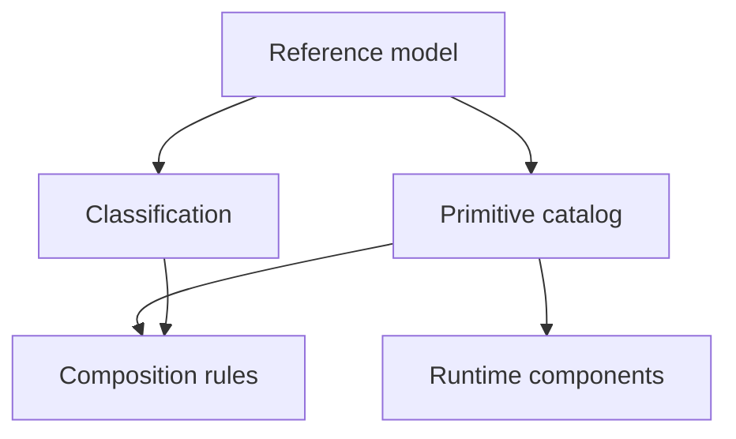

# Architecture Model

Status: Index

The building blocks of a workflow run, how they are classified, and how they may be combined. Everything here is vendor-neutral and refines the [reference model](reference-model.md).

## Contents

- [Reference model](reference-model.md) — the logical anatomy of a run and the five authorities.
- [Classification](classification.md) — the eight coordinate axes that locate a run on the spectrum.
- [Primitive catalog](primitive-catalog.md) — the reusable capability building blocks (three-letter mnemonics).
- [Runtime components](runtime-components.md) — the logical services that host primitives (`RC-##`).
- [Composition rules](composition-rules.md) — how primitives may be combined (`CR-###`) and the anti-patterns (`AP-##`).

## How they fit together

The machine-readable form of everything here is in [registry.yaml](../../descriptor/registry.yaml).
