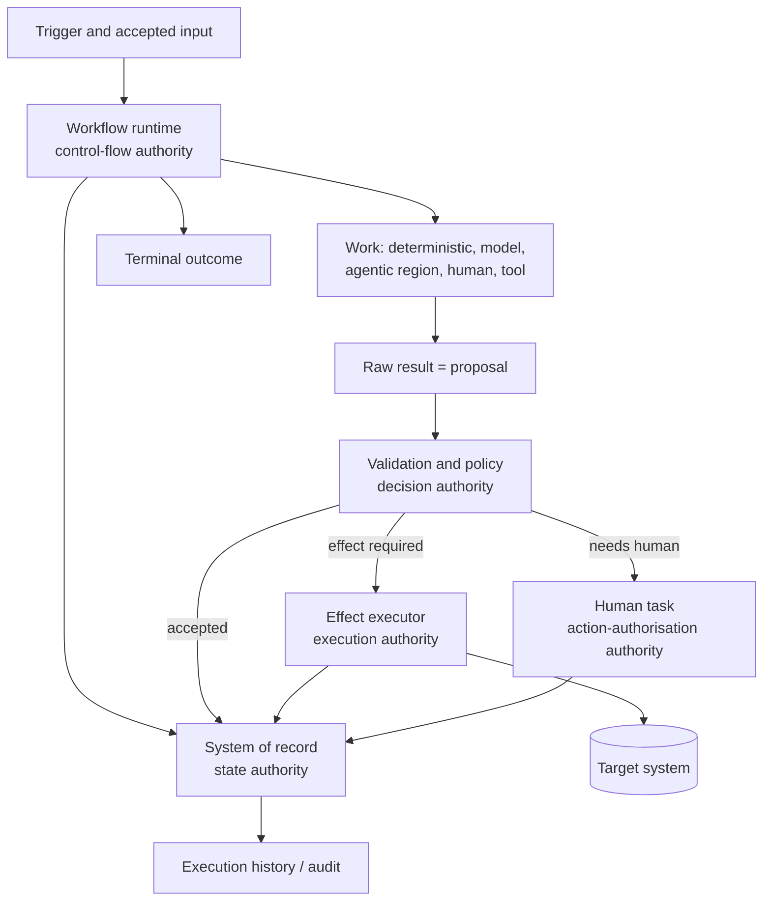
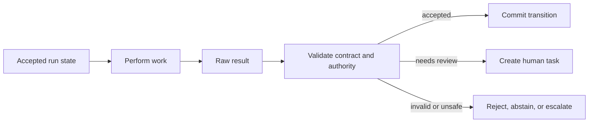

# Reference Model

Status: Mature

## Why this document exists

The reference model is the "big picture": the logical anatomy of a workflow run, independent of any engine or framework. Everything else in `02-architecture-model/` refines a part of it.

## The workflow run at a glance

The five labels on that diagram are the **five authorities**, and they are the core of the model.

## The five authorities

"Who is in control" is too imprecise for review. WERA separates control into five authorities that MAY be held by different actors for the same step ([INV-006][architecture-invariants]).

| Authority | Question | Typical holder |
|---|---|---|
| Control-flow | Who determines the next valid step or transition? | Workflow runtime (`RC-01`) |
| Decision | Who makes or accepts the authoritative business decision? | Policy + human, per step |
| Action-authorisation | Who permits an externally visible action? | Policy decision point (`RC-03`) / human |
| Execution | Which component technically performs the action? | Effect executor / adapter (`RC-07`) |
| State | Which system records accepted workflow state? | System of record (`RC-02`) |

### Worked allocation — invoice draft creation

| Authority | Holder |
|---|---|
| Control-flow | Workflow runtime following validated disposition rules |
| Decision | AP policy plus human reviewer for final draft acceptance |
| Action-authorisation | Policy allows an unposted draft; reviewer authorises only the exact reviewed version |
| Execution | Deterministic ERP adapter with constrained credentials |
| State | Workflow system of record, linked to ERP draft identity and version |

The recommendation agent recommends coding but holds **none** of the authority to create or approve the ERP draft.

## Proposals and accepted transitions

A step result may be a **proposal** rather than an **accepted transition**. The workflow accepts a proposal only after the relevant validation, policy, evidence, and authority checks succeed ([INV-003][architecture-invariants]).

## Static and dynamic execution

The model supports static sequences and graphs, parameterised branches, bounded dynamic expansion, accepted plan revision, parallel branches with explicit join semantics, and child or remote sub-runs. Dynamic behaviour never removes the need for explicit state ownership, capability boundaries, budgets, exit states, and effect permissions ([DP-09](../01-foundations/design-principles.md), [INV-008][architecture-invariants]).

## Bounded agentic region

A bounded agentic region delegates a goal and limited action-selection authority to an agent under an explicit contract (goal, accepted context, allowed tools/data, maximum effect level, budgets, expected outcomes, exit states, state owner, return conditions). The surrounding workflow remains responsible for accepting the region's outcome and choosing the next valid transition. See pattern [`WP09`](../03-patterns/wp09-bounded-agentic-region.md).

## Control transfer / handoff

Control transfer is an explicit transition between actors or runtimes. It carries run/task identity, delegated goal, accepted context, allowed capabilities, effect permissions, budget/deadline, expected result and exit states, and state-ownership. An event MAY trigger reconsideration of a pending transition without automatically acquiring control-flow authority. See primitive `HND` and pattern [`WP11`](../03-patterns/wp11-cross-runtime-handoff.md).

## Where to go next

- The building blocks that fill the "Work" box: [primitive catalog](primitive-catalog.md).
- The logical services that host them: [runtime components](runtime-components.md).
- How blocks may be combined: [composition rules](composition-rules.md).
- How a run is located on the spectrum: [classification](classification.md).

<!-- link definitions -->
[architecture-invariants]: ../01-foundations/architecture-invariants.md
