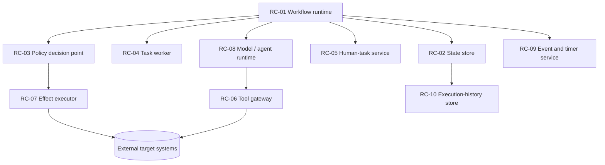

# Runtime Components

Status: Mature

## Why this document exists

Primitives are logical capabilities; **runtime components** (`RC-##`) are the logical services that host them. They are deliberately product-neutral ([INV-016](../01-foundations/architecture-invariants.md)): a single product may implement several components, and one component may be split across services.

| Code | Component | Responsibility | Hosts primitives (typical) |
|---|---|---|---|
| RC-01 | Workflow runtime | Holds control-flow authority; drives transitions, waits, retries, recovery | SEQ, DBR, PAR, LOP, RTY, WAI, TMO, CAN |
| RC-02 | State store / system of record | Holds state authority; records accepted state for recovery | CHK, EVH |
| RC-03 | Policy decision point | Action-authorisation and policy decisions | POL, DVL |
| RC-04 | Task worker | Executes deterministic units of work | DFN, BRL, XFM, SCH |
| RC-05 | Human-task service | Presents tasks, records human outcomes | HRV, APR, UNC |
| RC-06 | Tool / capability gateway | Mediates external calls under least privilege | TRO, TRW, TSL |
| RC-07 | Effect executor / adapter | Holds execution authority; performs effects with constrained credentials | TRW, THI, TXN, IDM, RCP, CMP |
| RC-08 | Model / agent runtime | Runs models and bounded agentic regions | AIN, CLS, GEN, REC, PLN, DLG |
| RC-09 | Event and timer service | Delivers events/timers for durable waits | WAI, event delivery |
| RC-10 | Execution-history / audit store | Durable, queryable record of accepted transitions and effects | AUD, EVH, TRC emit |

## Component relationships

## Minimal vs optional

The minimal set for any consequential workflow is `RC-01`, `RC-02`, and `RC-03`. A workflow with effects adds `RC-07`; with humans, `RC-05`; with models/agents, `RC-08`; with external tools, `RC-06`; with durable waits, `RC-09`. `RC-10` is required at readiness tier `RT2` and above.

## Open questions

- Should policy decision (`RC-03`) and effect execution (`RC-07`) always be separate components, or may they be co-located below a certain impact tier?
- How should a **remote** runtime be represented for cross-runtime handoff (`WP11`) — as a peer `RC-01` behind an `HND` boundary?
