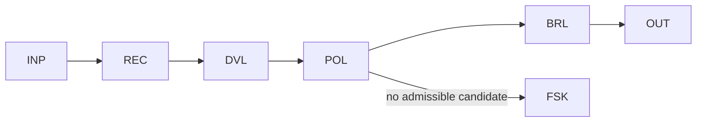

# WP02 — Recommend + Deterministic Adjudication

Status: Mature

## Problem
A step benefits from a model's judgement to narrow options, but the decision
itself must remain deterministic, auditable, and owned by the workflow. If the
model both recommends and decides, the system inherits ungoverned selection
authority. This pattern lets the model recommend from a closed candidate set
while deterministic logic adjudicates the final choice.

## When to use / not use
- Use when candidates form a closed, enumerable set and a policy can adjudicate.
- Use when you need a human-legible recommendation plus a rule-bound decision.
- Do not use when the candidate set is open-ended (no closed set to adjudicate).
- Do not use when the model must be allowed to act on its own recommendation.

## Structure
The model recommends from a closed candidate set; deterministic validation and
policy adjudicate; the workflow retains decision authority and records the
coded outcome.



## Primitives
- `INP` — typed input plus the closed candidate set.
- `REC` — recommends one or more candidates from that set.
- `DVL` — validates that each recommendation is a member of the set.
- `POL` — policy adjudication over the validated recommendations.
- `BRL` — business rules that finalise and record the decision.
- `FSK` — fail-safe when no candidate is admissible.
- `OUT` — coded decision admitted to state.

## Authority allocation
| Authority | Holder |
|---|---|
| Control-flow | workflow |
| Decision | workflow (policy adjudicates) |
| Action-authorisation | workflow |
| Execution | workflow |
| State | workflow |

## Invariants and rules
- INV-003 — only accepted transitions occur; the candidate set is closed.
- INV-009 — a recommendation is a proposal, never a self-authorised effect.
- INV-005 — admitted vs. fail-safe outcomes are distinguishable.
- INV-002 — the workflow remains authoritative state owner.
- DP-05 — proposals validated before state; DP-07 — prefer closed sets.

## Coordinates
```yaml
nondeterminism: ND3
control_flow_authority: workflow
actor_topology: single_agent
flow_shape: FS3
durability: DUR1
effect_level: EF1
assurance: AS2
impact: IM2
```

## Failure modes
- Set leakage: recommendation references a candidate outside the closed set.
- Adjudication gap: policy has no branch for a valid recommendation combination.
- Anchoring: downstream treats the recommendation as the decision.

## Consequences
- Benefits: model judgement improves quality while decisions stay rule-bound.
- Benefits: fully auditable — recommendation and adjudication are both recorded.
- Costs: requires a genuinely closed candidate set and a maintained policy.

## Example
In [invoice processing](../../examples/invoice-processing/README.md), this is the
core coding-recommendation step: the model recommends a GL/cost-centre coding
from the closed chart of accounts (`REC`), `DVL` confirms membership, and `POL`
plus `BRL` adjudicate against spend rules and record the coded decision. The
workflow, not the model, owns the outcome; unmatched cases go to fail-safe.
