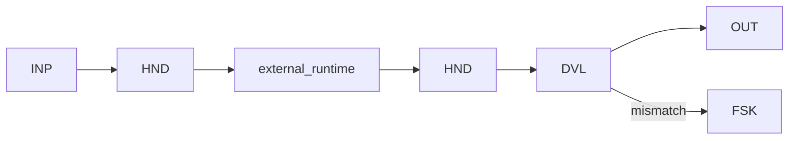

# WP11 — Cross-Runtime Handoff

Status: Proposal

## Problem
A workflow sometimes needs to hand execution to a different runtime — a separate
engine, service, or organisational boundary — and later resume with the result.
Without a portable, self-describing envelope, the receiving runtime cannot
reconstruct context and the boundary cannot be governed. This pattern proposes a
portable handoff envelope carried across runtimes.

## Candidate structure
The workflow serialises a portable envelope describing the goal, contract, and
state digest, then hands off to a remote runtime as a child/remote sub-run. The
remote runtime executes under its own authority; on return the envelope carries a
validated result that the originating workflow reconciles into its state.



- `HND` builds and hands off the portable envelope.
- `external_runtime` executes the sub-run under its own control-flow authority.
- `DVL` validates the returned envelope against the outbound contract and digest.
- `FSK` handles envelope mismatch or a failed remote sub-run.

## Typical coordinates
```yaml
nondeterminism: ND7
control_flow_authority: external_runtime
actor_topology: cross_runtime
flow_shape: FS9
durability: DUR3
effect_level: EF2
assurance: AS3
impact: IM3
```

## Relationship to other patterns
- Extends delegation beyond [WP10](wp10-multi-agent-delegation.md): here the
  boundary is a runtime/organisational one, not a co-located agent.
- Aligns with profile EP7 in [profiles](../04-profiles/README.md) and the descriptor
  interoperability work; cross-WG concepts are referenced, not redefined (INV-015).
- The originating side is typically a [WP08](wp08-durable-workflow-envelope.md)
  run so it can wait durably for the remote result.

## Open questions
- What is the minimum portable envelope schema, and how is it versioned and
  digest-linked across runtimes (INV-012)?
- How is identity and trust established across the boundary (XB-01, XB-02)?
- Which authority truly holds during the remote sub-run, and how is that made
  explicit (INV-006)?
- How is observability correlated across runtimes so the run stays auditable
  (XB-03, OV-07)?
- How are effects on the remote side reconciled or compensated if the originating
  run aborts (OV-03, OV-05)?
