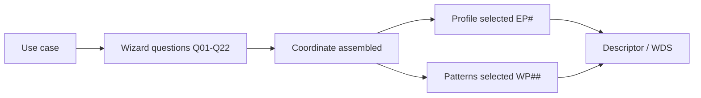

# Pattern and Profile Selection

Status: Mature

## Purpose

Turn a use case into a **profile + patterns + coordinates** through a repeatable process rather than personal preference. The same process is followed by a human architect and an AI agent (that is the point — see [acceptance test](../../docs/acceptance-test.md)).

The decision owner (a person or review team) remains accountable; the wizard and selection logic guide and explain the recommendation but do not replace review.

## The three artifacts

- **[wizard-questions.md](wizard-questions.md)** — the ordered questions (`Q01`…`Q22`) a designer answers, each mapping answers to codes.
- **[selection-logic.yaml](selection-logic.yaml)** — the same questions and mappings as machine-readable data, plus the primary-pattern selection algorithm, so an AI agent can execute the selection deterministically.
- **[pattern-coordinates.md](pattern-coordinates.md)** — how the answers assemble into a [classification coordinate](../02-architecture-model/classification.md) and how coordinates map to candidate patterns/profiles.

## Flow

The output feeds directly into the [descriptor](../../descriptor/README.md): the answers populate `intake`, the coordinate and selections populate `design`, and the rationale populates `recommendation`.
