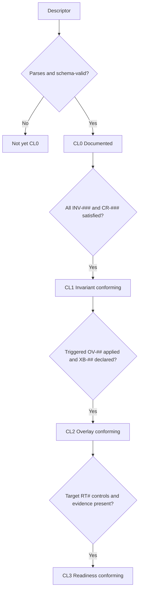

# Conformance

Status: Mature

Conformance levels (`CL#`) state how fully a workflow **follows this reference architecture**. Conformance is orthogonal to [readiness](readiness-tiers.md): a workflow can be operationally mature yet non-conformant, or fully conformant but only at pilot readiness.

| Code | Level | Meaning |
|---|---|---|
| CL0 | Documented | The workflow has a descriptor with intake, a primitive graph, coordinates, and an identified profile — but may not meet all invariants. |
| CL1 | Invariant conforming | Meets all applicable [invariants](../foundations/architecture-invariants.md) (`INV-###`) and the [composition rules](../model/composition-rules.md) (`CR-###`). |
| CL2 | Overlay conforming | `CL1` plus every triggered [workflow overlay](../overlays/workflow-overlays.md) (`OV-##`) is applied, and every touched [external boundary](../overlays/external-boundaries.md) (`XB-##`) is declared. |
| CL3 | Readiness conforming | `CL2` plus the controls and evidence for the target [readiness tier](readiness-tiers.md) (`RT#`) are present and verified. |

## How conformance is assessed

Because the design is captured as a [descriptor](../descriptor/README.md), most of `CL0`–`CL1` can be checked mechanically:

## Relationship to the acceptance test

[The acceptance test](../docs/acceptance-test.md) asks whether the repository can help someone *produce* a good design. Conformance asks whether a *given* design follows the architecture. A repository that passes the acceptance test should make `CL2` designs straightforward to produce and check.

## Exceptions

A workflow may claim a conformance level with **documented exceptions** (a rule consciously not met, with rationale and compensating control). Exceptions are recorded in the descriptor and surfaced at review; they do not silently lower the claimed level.
