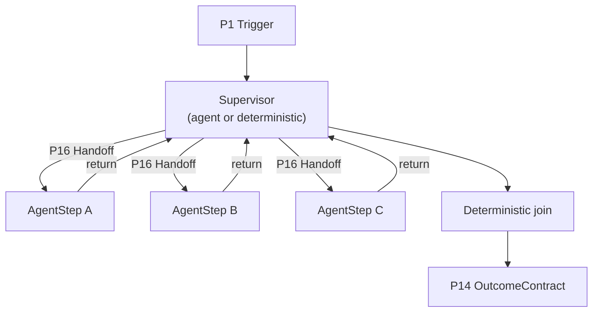
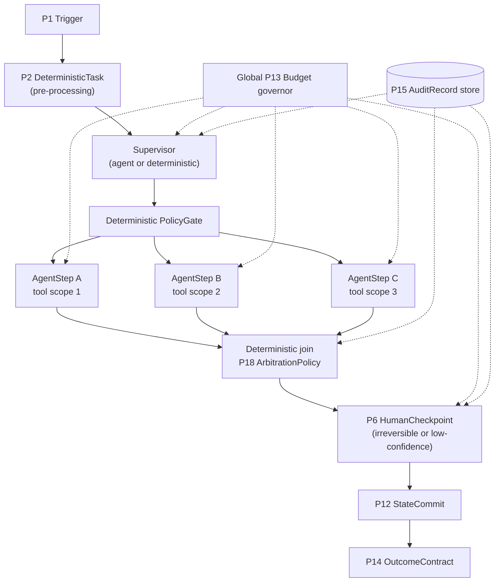

# T1 Supervisor / orchestrator-worker

**Status:** default multi-agent topology

**Primitives used:** [P4 AgentStep](../../taxonomy/primitives/p04-agent-step.md) per worker, [P16 Handoff](../../taxonomy/primitives/p16-handoff.md) from supervisor to each worker with a `delegate_and_wait` return contract, [P7 FanOut/FanIn](../../taxonomy/primitives/p07-fan-out-fan-in.md) when workers run concurrently, [P13 Budget](../../taxonomy/primitives/p13-budget.md) sub-allocated per worker, [P18 ArbitrationPolicy](../../taxonomy/primitives/p18-arbitration-policy.md) if worker outputs can conflict.

## Shape

One coordinating step decomposes the goal and delegates sub-goals to worker `AgentStep`s, then reconciles their outputs.

## When to choose it

This topology SHOULD be the default multi-agent topology, because it keeps exactly one locus of control and therefore exactly one place to enforce budget and termination. Every other topology in this catalog either weakens that locus ([T4](t4-peer-network.md), [T5](t5-shared-context.md)) or has a narrower purpose ([T2](t2-sequential-pipeline.md), [T3](t3-concurrent-fan-out.md), [T6](t6-generator-critic.md)).

The important variant: the supervisor MAY be a deterministic component rather than an agent, and if the decomposition into sub-goals is knowable in advance (the set of workers and the routing between them does not depend on run-time reasoning), the supervisor MUST be deterministic rather than an `AgentStep`. Camunda's AI Agent Sub-process connector illustrates the mechanism this document expects the deterministic variant to use: an embedded ad-hoc sub-process whose job-worker implementation chooses which inner elements to activate on each pass, giving deterministic, declarative control over which workers run without needing agent reasoning to select them (see [Camunda: AI Agent Sub-process connector](https://docs.camunda.io/docs/components/connectors/out-of-the-box-connectors/agentic-ai-aiagent-subprocess) and [Camunda: Ad-hoc sub-processes](https://docs.camunda.io/docs/components/modeler/bpmn/ad-hoc-subprocesses/)). This is also the topology closest to Anthropic's "orchestrator-workers" workflow pattern, and to AAIF's framing that mature practice augments deterministic orchestration with agents rather than replacing it (see [Anthropic: Building Effective Agents](https://www.anthropic.com/research/building-effective-agents); [AAIF: From Workflow Orchestration to Agentic Orchestration](https://aaif.io/blog/from-workflow-orchestration-to-agentic-orchestration)).

## When not to

Avoid it when subtasks belong to a different trust domain, or when the decomposition would change the coordinator itself into an unbounded agent.

## Characteristic failure mode

The supervisor becomes a second unbounded agent instead of a control point: if the supervisor is itself an `AgentStep` with no `P13 Budget` or termination condition tighter than the workflow's, it reintroduces exactly the unboundedness this topology exists to avoid.

## Where the deterministic boundary sits

At the supervisor's decomposition and join logic, whether or not the supervisor itself is an agent.

## Reference structure

The supervisor topology (T1) as a full workflow, showing the enforcement points that sit outside any agent's reasoning: the policy gate before delegation, the deterministic join with its arbitration policy, the human checkpoint on irreversible or low-confidence outcomes, and the two cross-cutting components (the global budget governor and the audit log) that touch every step in the workflow rather than sitting in the flow itself.

Every node on the dotted cross-cutting edges (`BG`, `AL`) is deterministic infrastructure, not an agent. The diagram is deliberately drawn so that the only nodes with agent-shaped internals are `S` (when the supervisor is agentic) and `A1`–`A3`. `PG`, `J`, `HC`'s gating logic, `SC`, `BG`, and `AL` are all outside the agent boundary by construction.

## Related

- [Handoff contract](../contracts/handoff.md)
- [AgentStep boundary contract](../contracts/agent-step-boundary.md)
- [P18 ArbitrationPolicy](../../taxonomy/primitives/p18-arbitration-policy.md)
- [T4 Peer network](t4-peer-network.md): the cross-organisational counterpart sequence diagram
- [`multi-agent.md`](../architectures/multi-agent.md)
