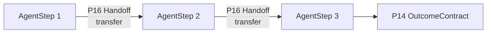

# T2 Sequential pipeline with handoff

**Primitives used:** [P16 Handoff](../../taxonomy/primitives/p16-handoff.md) with a `transfer` return contract at each stage boundary, [P8 TimerDeadline](../../taxonomy/primitives/p08-timer-deadline.md) on each handoff, [P15 AuditRecord](../../taxonomy/primitives/p15-audit-record.md) per stage.

## Shape

Staged execution where each stage's output contract is the next stage's input contract.

## When to choose it

Choose T2 when the work is genuinely staged (each stage fully consumes the prior stage's output and does not need to revisit it) and when auditability matters more than flexibility. This is the cheapest multi-agent topology to build, reason about, and audit: there is no concurrency, no shared mutable state, and the [handoff contract](../contracts/handoff.md) gives a single well-defined seam per stage. It is comparable to a sequence of BPMN call activities connected by message flow, each stage bounded like a Camunda ad-hoc sub-process (see [OMG BPMN 2.0](https://www.omg.org/spec/BPMN/2.0/)).

## When not to

Avoid it when stages need to run concurrently, or when a later stage needs context from more than one stage back.

## Characteristic failure mode

Error and context loss compound across handoffs. Because handoff is lossy by default (see the [handoff contract](../contracts/handoff.md)), a pipeline of `n` stages accumulates up to `n-1` opportunities for silently dropped context, and a failure at stage `k` may be undiagnosable without the discarded context from stage `k-1`.

## Where the deterministic boundary sits

At each handoff seam, where the receiving stage's input contract is validated before the stage begins.

## Related

- [Handoff contract](../contracts/handoff.md)
- [P8 TimerDeadline](../../taxonomy/primitives/p08-timer-deadline.md)
- [P15 AuditRecord](../../taxonomy/primitives/p15-audit-record.md)
- [`multi-agent.md`](../architectures/multi-agent.md)
