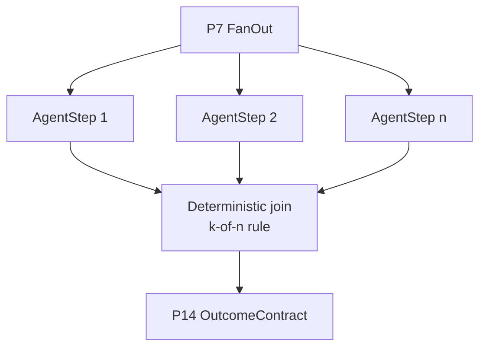

# T3 Concurrent fan-out with deterministic join

**Primitives used:** [P7 FanOut/FanIn](../../taxonomy/primitives/p07-fan-out-fan-in.md), [P13 Budget](../../taxonomy/primitives/p13-budget.md) bounding the maximum concurrent count, [P18 ArbitrationPolicy](../../taxonomy/primitives/p18-arbitration-policy.md) if concurrent outputs can disagree.

## Shape

Independent subtasks run concurrently; a deterministic aggregator combines their results.

## When to choose it

Choose T3 when subtasks are genuinely independent and latency to a combined result matters more than sequencing. The join MUST declare, in advance, what it does with `k` of `n` results (proceed once a quorum returns, wait for all `n`, or fail if fewer than `k` return) rather than leaving partial-completion behaviour implicit. Camunda's ad-hoc sub-process gives a concrete, auditable model for this: its `completionCondition` and `cancelRemainingInstances` attribute (default `true`) together express exactly a "proceed on `k` of `n`, cancel the rest" join rule, and its job-worker contract already forbids a worker from both satisfying the completion condition and activating new work in the same result: a useful constraint to carry over into any T3 join implementation (see [Camunda: Ad-hoc sub-processes](https://docs.camunda.io/docs/components/modeler/bpmn/ad-hoc-subprocesses/)). AWS Step Functions' parallel and map states are the equivalent construct in a non-BPMN orchestration engine (see [AWS Step Functions developer guide](https://docs.aws.amazon.com/step-functions/latest/dg/welcome.html)).

## When not to

Avoid it when subtasks share mutable state, or when one subtask's output should change what another does.

## Characteristic failure mode

Partial failure semantics left undeclared. If the join has no stated rule for `k` of `n`, a single slow or failed branch either blocks the whole workflow or is silently dropped, and neither behaviour was actually decided by anyone.

## Where the deterministic boundary sits

At the join, which MUST be deterministic even though the fanned-out branches are not.

## Related

- [P18 ArbitrationPolicy](../../taxonomy/primitives/p18-arbitration-policy.md)
- [P13 Budget](../../taxonomy/primitives/p13-budget.md)
- [`multi-agent.md`](../architectures/multi-agent.md)
