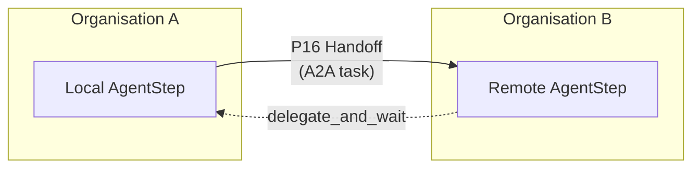
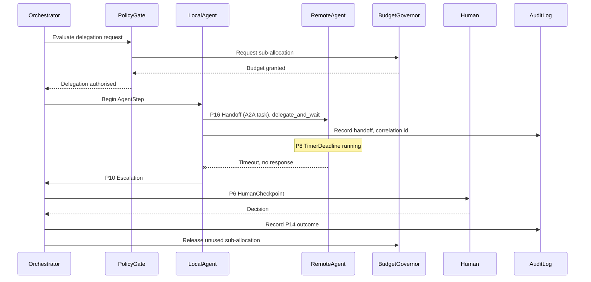

# T4 Peer network / cross-organisational delegation

**Status:** the least mature topology in this catalog, with no global termination guarantee

**Primitives used:** [P16 Handoff](../../taxonomy/primitives/p16-handoff.md) with an A2A binding, [P8 TimerDeadline](../../taxonomy/primitives/p08-timer-deadline.md) mandatory on every cross-boundary handoff, [P10 Escalation](../../taxonomy/primitives/p10-escalation.md) when the remote party fails to respond, [P15 AuditRecord](../../taxonomy/primitives/p15-audit-record.md) with a correlation identifier that survives the organisational boundary.

## Shape

No shared orchestrator; agents discover one another and delegate work directly. This is the A2A case.

## When to choose it

Choose T4 only when the organisational-or-trust-boundary reason for crossing into multi-agent (set out in the Purpose section of [`multi-agent.md`](../architectures/multi-agent.md)) actually holds: the counterpart agent is owned, operated, or authorised by a different organisation, so no shared supervisor is possible.

## When not to

Avoid it whenever a shared orchestrator could exist; [T1](t1-supervisor.md) with an internal `P16 Handoff` is strictly easier to govern than T4 with an external one.

## Characteristic failure mode

State bluntly: **T4 is the least mature topology in this catalog and needs the most external control.** There is no global termination guarantee inherent to the topology itself. Nothing stops a remote peer from never responding, and the local party has no authority over the remote party's internal budget or termination logic. Every T4 handoff MUST carry its own `P8 TimerDeadline` and `P10 Escalation` path precisely because the workflow cannot assume the remote side will terminate on its own.

## Where the deterministic boundary sits

At the local `PolicyGate` before delegation and at the local timeout/escalation logic after it: the workflow controls its own side of the boundary and nothing on the far side.

## Reference structure

The sequence below shows the enforcement pattern applied to a T4 cross-organisational delegation: a remote agent that may not respond, a mandatory timeout, and an escalation to a human when the timeout fires.

## Related

- [Handoff contract](../contracts/handoff.md)
- [P10 Escalation](../../taxonomy/primitives/p10-escalation.md)
- [P8 TimerDeadline](../../taxonomy/primitives/p08-timer-deadline.md)
- [T1 Supervisor](t1-supervisor.md): the internal-orchestrator counterpart flowchart
- [`multi-agent.md`](../architectures/multi-agent.md)
