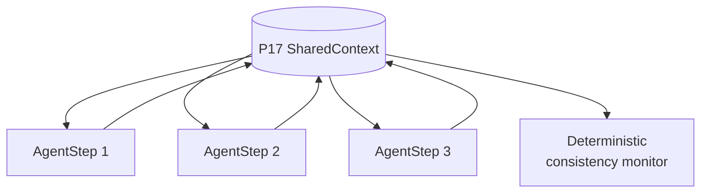

# T5 Shared-context / blackboard

**Primitives used:** [P17 SharedContext](../../taxonomy/primitives/p17-shared-context.md) with a declared consistency model, [P18 ArbitrationPolicy](../../taxonomy/primitives/p18-arbitration-policy.md) for conflicting writes, [P15 AuditRecord](../../taxonomy/primitives/p15-audit-record.md) of writes to shared state.

## Shape

Agents coordinate through `P17 SharedContext` rather than through direct handoffs.

## When to choose it

Choose T5 when several agents genuinely need to read and write a common evolving artifact and the work is not naturally sequential: a shared plan, a shared findings document, a shared case file. CMMN's case file is the nearest standards concept for exactly this shape of coordination (see [OMG CMMN](https://www.omg.org/spec/CMMN/)); LangGraph's channels-with-reducers model is the nearest agent-framework concept (see [LangGraph documentation](https://langchain-ai.github.io/langgraph/)).

## When not to

Avoid it when no consistency model can be agreed and declared.

## Characteristic failure mode

Write conflicts and stale reads. Without a declared consistency model, two agents can read the same state, act on it independently, and write back results that silently overwrite one another. Nothing in the topology will surface that this happened. T5 MUST declare its consistency model (for example: last-writer-wins with a version check, append-only with no overwrite, or single-writer-at-a-time enforced by a lock) before it is used; "eventually consistent" is not a sufficient answer on its own because it says nothing about what an agent should do when it observes a conflict.

## Where the deterministic boundary sits

At the consistency monitor and at `P18`, both of which sit outside any agent's reasoning.

## Related

- [P17 SharedContext](../../taxonomy/primitives/p17-shared-context.md)
- [P18 ArbitrationPolicy](../../taxonomy/primitives/p18-arbitration-policy.md)
- [`multi-agent.md`](../architectures/multi-agent.md)
