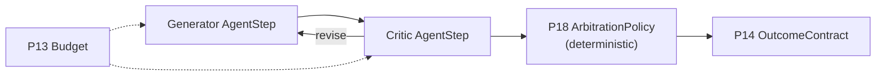

# T6 Generator-critic / evaluator-optimizer

**Primitives used:** [P13 Budget](../../taxonomy/primitives/p13-budget.md) as a hard iteration cap, [P18 ArbitrationPolicy](../../taxonomy/primitives/p18-arbitration-policy.md) as the deterministic stopping/acceptance rule, [P8 TimerDeadline](../../taxonomy/primitives/p08-timer-deadline.md) per iteration.

## Shape

One agent produces, another critiques, and the loop repeats until a stopping rule fires.

## When to choose it

Choose T6 when iterative quality improvement is worth the extra cost and a deterministic stopping rule can be stated in advance. This is Anthropic's "evaluator-optimizer" workflow pattern (see [Anthropic: Building Effective Agents](https://www.anthropic.com/research/building-effective-agents)).

A generator-critic loop is the multi-agent form of the iteration loop described in [Loop tiers](../guidance/loop-tiers.md), and the critic is one way to implement a [P19 EvaluationGate](../../taxonomy/primitives/p19-evaluation-gate.md), a non-deterministic one, which is why the arbiter must be separate and deterministic.

## When not to

Avoid it when no independent arbiter is available, or when the iteration count cannot be bounded.

## Characteristic failure mode

Unbounded critique loops. A generator-critic loop with no cap will iterate for as long as the critic can find something to critique, which for an LLM critic is close to indefinitely. T6 MUST have a `P13 Budget` bounding the number of iterations and a deterministic stopping rule (accept, reject, or escalate) evaluated outside the critic's own reasoning. The critic MUST NOT also be the arbiter (see [P18 ArbitrationPolicy](../../taxonomy/primitives/p18-arbitration-policy.md)): if the same agent both critiques the work and decides when critique is "good enough," there is no independent check left in the loop, and the loop's termination depends entirely on that one agent's judgement rather than on a declared rule.

## Where the deterministic boundary sits

At `P18`, which sits strictly outside both the generator and the critic.

## Related

- [P18 ArbitrationPolicy](../../taxonomy/primitives/p18-arbitration-policy.md)
- [P19 EvaluationGate](../../taxonomy/primitives/p19-evaluation-gate.md)
- [Loop tiers](../guidance/loop-tiers.md)
- [P13 Budget](../../taxonomy/primitives/p13-budget.md)
- [`multi-agent.md`](../architectures/multi-agent.md)
